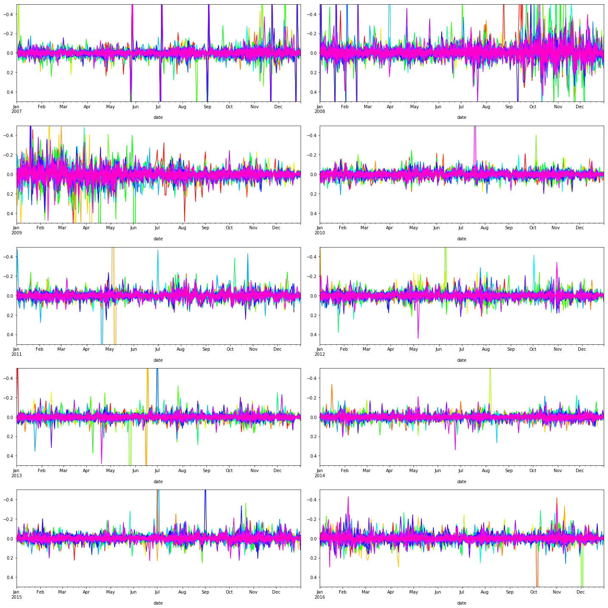
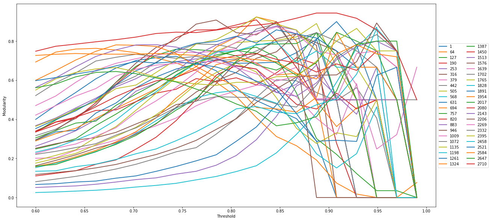
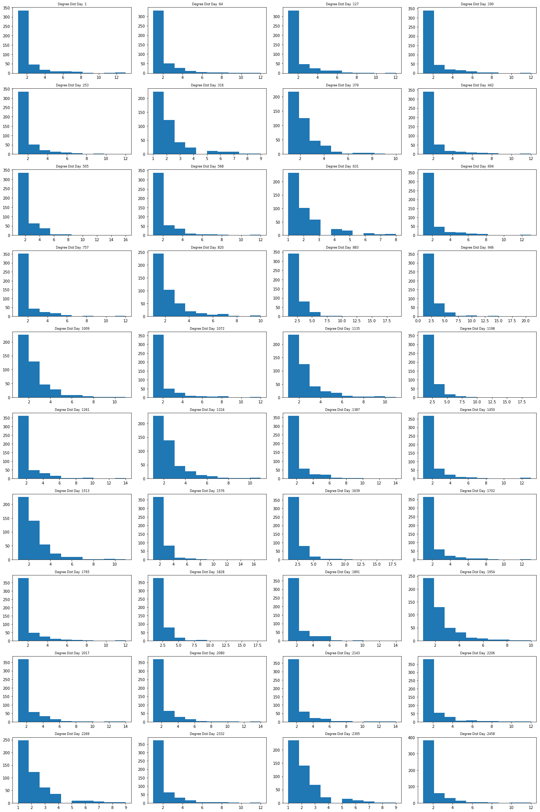
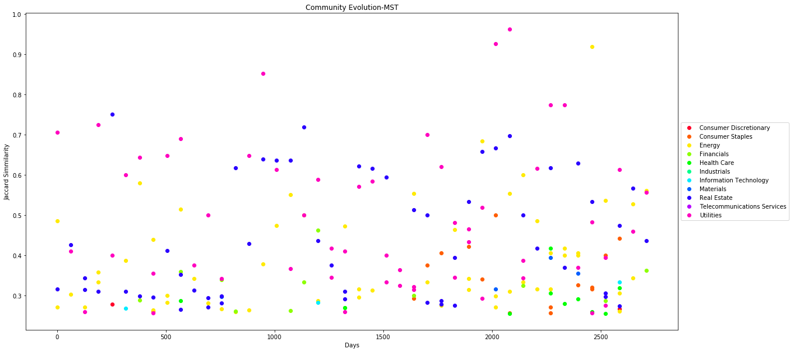

```python
from IPython.display import HTML

HTML('''<script>
code_show=true; 
function code_toggle() {
 if (code_show){
 $('div.input').hide();
 } else {
 $('div.input').show();
 }
 code_show = !code_show
} 
$( document ).ready(code_toggle);
</script>
<form action="javascript:code_toggle()"><input type="submit" value="Click here to toggle on/off the raw code."></form>''')
```


<script>
code_show=true; 
function code_toggle() {
 if (code_show){
 $('div.input').hide();
 } else {
 $('div.input').show();
 }
 code_show = !code_show
} 
$( document ).ready(code_toggle);
</script>
<form action="javascript:code_toggle()"><input type="submit" value="Click here to toggle on/off the raw code."></form>


# <center>Network Analysis of Financial Markets<center>
## <center>(Karthick Venkatesan)<center>

# 1. Abstract 
In this project we have analysed the dynamics of the Financial Markets through Network Analysis.We have built networks of the equities that are part of the  S and P 500 index over a range Time Periods between 2007 and 2017 based on Winner Take All and the Minimum Spanning Tree method .Both these methods utilise the correlation coefficient computed between the attributes of these stocks such as Price,Volume,Returns etc . Community detection techniques were then applied to the constructed networks. The resulting communities were compared for consistency with the identified market sections using Standard Industrial Classification code.We also studied the evolution of the network and the  communities over the study period and found interesting behaviors. We have compared our results from both the methods for each of our analysis.We created a GEXF file for this dynamic network and visuvalised the same  in Gephi a open source network visuvalisation software.The visualization results offer a very intuitive
way to look at the overall correlation structure of different the equities in the S and P 500 and evolution of these networks over a period of time .

# 2. Introduction

Network analysis of Equities is a extensively researched topic and in section 3 we have detailed current literature which was utilised as part of this project.In all the current studies the focus has been on studying the properties of the market in a stationary view  for a fixed time period.By leveraging the techniques noted in these current literature we have as part of this study built multiple networks of the stocks in the S and P 500 index for mutiple non overlapping windows of Time Period (T) between 2007 and 2017 and studied how the network evolves and how the communities in the network behave with the changing dynamics of the market.

Below are key Objectives of the project.For each of these items we have compared the results we got for for the networks built based on both these methods. 

    1. Build network for the stocks in  S and P 500 index based on the correlations between Prices/Volume for Multiple Time Periods using Winner Take All method and Minimum Spanning Tree Method
    2. Analyse the topology of the networks in multiple time periods.Does the network of stocks exhibit scale free properties at each of the time period?
    3. Detect communities in these networks and find out if the stocks actually trade in groups based on the SIC(Standard Industry Classification) Code.
    4. Studied the evolution of these communities 
    5. Find important stocks and sectors they belong to based on the Network Properties at Different time periods.
    6. Visuvalize the network and also the dynamic evolution of network by building dynamic graphs using Gephi

# 3. Literature Review

Current Studies about network analysis for stock market can be classified
into below categories : 

   (1) Applying network analysis techniques for different markets and analyze the topological characteristics of each market 
             [Statistical Analysis of Financial Markets][1],
             [Hierarchical structure in financial markets][2]
       
   (2) Propose different correlation metric analysis among various stock markets to suggest different definitions of edges between stocks and study the impact on the network using different edge definitions
             [Network analysis of a financial market based on genuine correlation and threshold method][3],
             [Network of Equities in Financial Markets][4],
             [A network perspective of the stock market][5]

[1]:https://www.researchgate.net/publication/222564938_Statistical_analysis_of_financial_networks
[2]:https://www.researchgate.net/publication/253665724_Hierarchical_structure_in_financial_market
[3]:https://www.researchgate.net/publication/228454212_Network_analysis_of_a_financial_market_based_on_genuine_correlation_and_threshold_method
[4]:https://arxiv.org/pdf/cond-mat/0401300.pdf
[5]:https://www.researchgate.net/publication/222825530_A_network_perspective_of_the_stock_market
[6]:https://www.researchgate.net/publication/5499066_Detrended_Cross-Correlation_Analysis_A_New_Method_for_Analyzing_Two_Nonstationary_Time_Series
[7]:https://www.researchgate.net/publication/44884990_Time-lag_cross-correlations_in_collective_phenomena

## 3.1. Edge Definition

Approach to construct the edges of stock market network is
not unique. In the current literature, multiple measures were
investigated to construct the edges between nodes namely [Zero-lag correlation][2],[Detrended covariance][6],[Time-lag correlations of prices changes over a certain period of time][7] 


## 3.2. Network Properties
Studies have covered both emerging and mature markets. Authors
claim that understanding the topological properties can
help to understand correlation patterns among stocks, thus providing
guidance for risk management. Topological properties
often of interest include degree distribution, clustering and component
structure. In this subcategory study, usually only one
correlation measure is proposed to establish the connections
between nodes. In the introduction session of [Statistical Analysis of Financial Markets][1], the author
covered a wide range of previous studies in this category

# 4. Build Network
## 4.1 Data Collection

We collected the prices for the stocks that trade in both NASDAQ and the NYSE stock exchange from [Eod Data][8] . The data consisted of Opening , Closing prices , Volume information for each trading day for the period of 2007 to 2017.From this data we filtered and selected only the prices that are a part of S and P 500 . We chose the [S and P 500][9] since the index had a well balanced portfolio of stocks from different industry segments .

[8]:http://eoddata.com/
[9]:https://en.wikipedia.org/wiki/S%26P_500_Index


```python
## Read S and P 500 list
import pandas as pd
import numpy as np
dfsp500 = pd.read_csv('data/SANDP500.csv')
companies=dfsp500['Symbol'].tolist()
companies=np.random.choice(companies, size=500, replace=False)
```


```python
import glob
import os
path = r'data/NASDAQ'                     
all_files = glob.glob(os.path.join(path, "*.txt"))     
df_from_each_file = (pd.read_csv(f) for f in all_files)
concatenated_df_NAS   = pd.concat(df_from_each_file, ignore_index=True)
concatenated_df_NAS=concatenated_df_NAS[concatenated_df_NAS['<ticker>'].isin(companies)]

path = r'data/NYSE'                     
all_files = glob.glob(os.path.join(path, "*.txt"))     
df_from_each_file = (pd.read_csv(f) for f in all_files)
concatenated_df_NYS   = pd.concat(df_from_each_file, ignore_index=True)
concatenated_df_NYS=concatenated_df_NYS[concatenated_df_NYS['<ticker>'].isin(companies)]

concatenated_df = pd.concat([concatenated_df_NAS,concatenated_df_NYS])
```


```python
col_p = 'close'
concatenated_df.columns = ['ticker','date','open','high','low','close','vol']
concatenated_df=concatenated_df[concatenated_df['ticker'].isin(companies)]
concatenated_df=concatenated_df.merge(dfsp500,left_on='ticker',right_on='Symbol')
concatenated_df['ticker'] = concatenated_df['ticker']
df_price = concatenated_df[['ticker','date',col_p]]
df_price=df_price.drop_duplicates( keep='last')
df_price['date'] = pd.to_datetime(df_price['date'], format='%Y%m%d', errors='ignore')
df_price.set_index(['date','ticker'],inplace=True)
df_price=df_price.unstack()[col_p]
df_price.reset_index(inplace=True)
df_price.fillna(method='bfill',inplace=True)
df_price.fillna(method='ffill',inplace=True)
```

## 4.2 Detrend data - Compute log returns

Of the methods in current literature number we choose [Time-lag correlations of prices changes over a certain period of time][7] .One of the keys challenges in computing the correlation on stock prices is that the values are moving time series and have inherent trends which can lead to spurious correlations if the data is not properly normalised.

If we think about a time series of prices, you could write it out as 

    [P0,P1,P2,...,PN], or [P0,P0+R1,P0+R1+R2,...,P0+R1+...+RN], where Ri = Pi-P(i-1). 

Written this way we can see that the first return R1, contributes to every entry in the series, whereas the last only contributes to one. This gives the early values in the correlation of prices more weight than they should have.

So for computing the correlation we take the difference between the prices for each day giving us the returns for each .We computed the log returns between two days since it has a key benefit of being additive over multiple time periods .

Though log returns can be computed over multiple time periods of 7 , 30 , 60 , 100 days for the sake of simplicity we kept the return window to 1 day.

[7]:https://www.researchgate.net/publication/44884990_Time-lag_cross-correlations_in_collective_phenomena


```python
import scipy.signal
t = 1
for key in df_price.columns:
    if key not in companies:
        continue
    try:
        df_price[key] = np.log(df_price[key]) - np.log(df_price[key].shift(t))
    except:
        print (key)
df_price.set_index('date',inplace=True)
```


```python
## A quick visualization: detrended data
import matplotlib.pyplot as plt
%matplotlib inline
import random as rn
NUM_COLORS = len(companies)
cm = plt.get_cmap('gist_rainbow')
colors = [cm(i/NUM_COLORS) for i in range(NUM_COLORS)]
rn.seed = len(companies)  # for choosing random colors
fig, ax = plt.subplots(nrows=5,ncols=2,figsize=(20, 20))
y=2007
for row in ax:
    for col in row:
        yfs = str(y) + '0101'
        yfe = str(y) + '1231'
        n = 0
        col.set_ylim([0.5, -0.5])
        for i in df_price.columns:
            df_price.loc[yfs:yfe][i].plot(ax=col,color=colors[n])
            n = n + 1
        y = y + 1
plt.tight_layout()
plt.show()
```





## 4.3 Compute Correlation matrix for multiple windows

Next we computed the pearson correlation between the log returns.The data is divided into  windows of width (T)  in order to uncover dynamic characteristics of the networks. The window width  corresponds to the number of daily returns included in the computation of the correlation between Stocks. The method of time windows division to construct asset graphs can be found in the literature [Asset trees and asset graphs in financial markets][10]

To determine the ideal length of the window we computed the mean correlation for window values of 21,42,63,84 and 105 and plotted the variations in the correlation.As seen in the plot the window of 63 captures the fluctuations of the market well.Values less than this are too noisy and higher than this we lose the sensitivity in the changes in the market .Also from a market perspective 63 days ideally falls into the Quarterly reporting cycle of these companies so we felt it would be appropriate choice

The correlation matrix is then computed based on this window length of 63 by dividing the period between 2007 and 2017 into multiple windows.

[10]:https://arxiv.org/abs/cond-mat/0303579


```python
import matplotlib.pyplot as plt
%matplotlib inline
corr_dict = {}
T = 1
for w in range(21,126,21):
    x = []
    y = []
    W = w
    for i in range(t,len(df_price),W):
            dkey = i
            corr_dict[dkey]=df_price.iloc[i:(i+W)].corr(method='pearson')
            corr_dict[dkey].fillna(0,inplace=True)
            x.append(dkey)
            y.append(np.mean([abs(j) for j in corr_dict[dkey].values.flatten().tolist()]))
    plt.plot(x,y)
    plt.xlabel('Days')
    plt.ylabel('Mean Correlation')
    plt.legend(list(range(21,126,21)), loc='center left', bbox_to_anchor=(1, 0.5),ncol=1)
plt.show()
W = 63
corr_dict = {}
for i in range(t,len(df_price),W):
      dkey = i
      corr_dict[dkey]=df_price.iloc[i:(i+W)].corr(method='pearson')
      corr_dict[dkey].fillna(0,inplace=True)
```


# 4.4 Build network - (Winner take all method)
Literature [A network perspective of the stock market][5] details the winner take all method where we build a network based on the correlation matrix if the value of the Correlation index is greater than a threshold.

What is the ideal value of threshold ?.Since one the key objectives of the study is to find if the stocks behave in groups we wanted to select a threshold which maximises the modularity .However we were also consious not overfit the data in which case we might loose some of the underlying dynamics at work in the market.

In the next step we built the network based on different thresholds ranging from 0.6 to 0.99 for  the windows identified .We then picked the value of the threshold from the values where the modularity is maximum.On analysis of this result we noted that most networks tended to have a high modularity for threshold value between 0.75 and 0.85 .There were certains windows where the threshold for the best modularity was seen to be greater than 0.9 however at this threshold the number edges was very less so in such cases we set the threshold to 0.8 and built the network.We treated both positive and negative correlations the same and looked at the absolute value.

[5]:https://www.researchgate.net/publication/222825530_A_network_perspective_of_the_stock_market


```python
import networkx as nx
import community
def get_modularity(y,threshold):
    df_price_corr = corr_dict[y]
    elist = []
    outdict=df_price_corr.to_dict()
    for i in outdict.keys():
        for j in outdict[i].keys():    
            if abs(outdict[i][j]) > threshold :
                if i == j :
                    continue
                if i < j:
                    elist.append([i,j,dict(weight=abs(outdict[i][j]),start=y,end=y+W)])
                    #elist.append([i,j,dict(start=y,end=y+1)])
                else:
                    None
    #print (len(elist))
    G=nx.Graph()
    G.add_edges_from(elist)
    #print (nx.info(G))
    partition = community.best_partition(G)
    try:
        m = community.modularity(partition, G)
    except:
        m = 0 
    return m
# This will be our list of fractions to run the simulation over
fractions = np.linspace(0.6, 0.99, 20)
M_list = {}
for y in corr_dict.keys():
    M_list[y] = [ get_modularity(y, frac)  for frac in fractions ]
```

The below is the plot between the threshold value and the computed markdown in the various windows


```python
import matplotlib.pyplot as plt
%matplotlib inline
plt.figure(figsize=(20,10))
for y in corr_dict.keys():
    plt.plot(fractions, M_list[y], lw=2)
plt.legend(list(M_list.keys()), loc='center left', bbox_to_anchor=(1, 0.5),ncol=2)
plt.xlabel('Threshold')
plt.ylabel('Modularity')
plt.show()
```





```python
# Pick value of threshold for each Window (T)
T_val = {}
for y in M_list.keys():
    val, idx = max((val, idx) for (idx, val) in enumerate(M_list[y]))
    if fractions[idx] > 0.8:
        T_val[y] = 0.8
    else:
        T_val[y] = fractions[idx]
    #print (str(y) + ":" + str(T_val[y]))
```


```python
# Create Edge List
elist_dict={}
for y in corr_dict.keys():
    df_price_corr = corr_dict[y]
    threshold = T_val[y]
    elist = []
    outdict=df_price_corr.to_dict()
    for i in outdict.keys():
        for j in outdict[i].keys():
            if abs(outdict[i][j]) > threshold :
                if i == j :
                    continue
                if i < j:
                    elist.append([i,j,dict(weight=1,start=y,end=y+W-1)])
                else:
                    None
    elist_dict[y] = elist
```


```python
# Constructing the graph different windows
import networkx as nx
import community
G_dict = {}
for y in elist_dict.keys():
    G=nx.Graph()
    elist = elist_dict[y]
    G.add_edges_from(elist)
    values = dfsp500.set_index('Symbol').to_dict(orient='dict')['Sector']
    for node, value in values.items():
        try:
            G.node[node]['Sector'] = value
        except:
            #name = (value[0:3] + '-' + node)
            #G.add_node(name,Sector=value)
            None
    partition = community.best_partition(G)
    
    deg_cent=dict((k,float(v)) for k,v in nx.degree_centrality(G).items())
    degree = dict((k,float(v)) for k,v in nx.degree(G).items())
    #katz_cent=nx.katz_centrality(G)
    #eigen_cent= dict((k,float(v)) for k,v in nx.eigenvector_centrality(G).items()) 
    close_cent= dict((k,float(v)) for k,v in nx.closeness_centrality(G).items())  
    betw_cent= dict((k,float(v)) for k,v in nx.betweenness_centrality(G).items()) 
    nx.set_node_attributes(G, "community", partition)  
    nx.set_node_attributes(G, "degreecent", deg_cent)
    nx.set_node_attributes(G, "degree", degree)
    #nx.set_node_attributes(G, "katz", katz_cent)
    #nx.set_node_attributes(G, "eigenvector", eigen_cent)
    nx.set_node_attributes(G, "closeness", close_cent)
    nx.set_node_attributes(G, "betweenness", betw_cent)
    nx.set_node_attributes(G, 'start',y)
    nx.set_node_attributes(G, 'end',y+W-1)
    #G.remove_nodes_from(nx.isolates(G)) 
    #T = nx.minimum_spanning_tree(G)
    T = G
    G_dict[y] = T
```


```python
# Collect the node level attributes for the nodes for all the windows
df_list = []
for k in G_dict.keys():
    G = G_dict[k]
    a = G.node
    df_list.append(pd.DataFrame(a).T.reset_index())
attrib_df = pd.concat(df_list)
attrib_df.fillna(0,inplace=True)
attrib_df1=attrib_df.merge(dfsp500,left_on='index',right_on='Symbol')
attrib_df = attrib_df1[['index','Sector_x','betweenness','closeness','community','degree','degreecent','start','Name']]
attrib_df.columns=['ticker','Sector','Betweeness','Closeness','Community','Degree','DegreeCent','start','Name']
```


```python
# Collect the graph level  attributes for all the windows
from scipy.stats import linregress
G_val_dict = {}
for Y in G_dict.keys():
    G_val = {}
    G= G_dict[Y]
    G_val['nodes'] =  int(nx.number_of_nodes(G))
    G_val['edges'] =  int(nx.number_of_edges(G))
    #G_val['AvgDegree'] =  nx.average_degree(G)
    G_val['AvgClustering'] = nx.average_clustering(G)
    try:
        G_val['AvgShortestPathLength'] = nx.average_shortest_path_length(G)
    except:
        G_val['AvgShortestPathLength'] = 99999
    try:
        G_val['Diameter'] = nx.diameter(G)
    except:
        G_val['Diameter'] = 99999
    degs = {}
    for n in G.nodes() :
        deg = G.degree(n)
        if deg not in degs.keys() :
            degs[deg] = 0
        degs[deg] += 1
    items = sorted(degs.items())
    x= [k for (k , v ) in items ]
    y= [ v for (k ,v ) in items ]
    xlog= np.array([np.log(k) for (k , v ) in items ])
    ylog= np.array([np.log(v) for (k ,v ) in items ])
    slope,intercept,rvalue,pvalue,stderr=linregress(xlog,ylog)
    G_val['Slope'] = slope
    G_val['No of Communities'] = attrib_df.groupby(by=['start'])['Community'].nunique().ix[Y]
    G_val_dict[Y] = G_val
Gvaldf=pd.DataFrame(G_val_dict).T
```

    /opt/conda/lib/python3.6/site-packages/ipykernel_launcher.py:32: DeprecationWarning: 
    .ix is deprecated. Please use
    .loc for label based indexing or
    .iloc for positional indexing
    
    See the documentation here:
    http://pandas.pydata.org/pandas-docs/stable/indexing.html#deprecate_ix


The below table lists the network  properties for the networks created using the Winner Take All Method Method over multiple Time Periods.


```python
pd.options.display.max_rows = 999
Gvaldf
```


<div>
<style>
    .dataframe thead tr:only-child th {
        text-align: right;
    }

    .dataframe thead th {
        text-align: left;
    }

    .dataframe tbody tr th {
        vertical-align: top;
    }
</style>
<table border="1" class="dataframe">
  <thead>
    <tr style="text-align: right;">
      <th></th>
      <th>AvgClustering</th>
      <th>AvgShortestPathLength</th>
      <th>Diameter</th>
      <th>No of Communities</th>
      <th>Slope</th>
      <th>edges</th>
      <th>nodes</th>
    </tr>
  </thead>
  <tbody>
    <tr>
      <th>1</th>
      <td>0.437301</td>
      <td>99999.000000</td>
      <td>99999.0</td>
      <td>17.0</td>
      <td>-0.734717</td>
      <td>462.0</td>
      <td>139.0</td>
    </tr>
    <tr>
      <th>64</th>
      <td>0.583921</td>
      <td>99999.000000</td>
      <td>99999.0</td>
      <td>19.0</td>
      <td>-0.555489</td>
      <td>897.0</td>
      <td>178.0</td>
    </tr>
    <tr>
      <th>127</th>
      <td>0.538656</td>
      <td>99999.000000</td>
      <td>99999.0</td>
      <td>16.0</td>
      <td>-1.081694</td>
      <td>307.0</td>
      <td>112.0</td>
    </tr>
    <tr>
      <th>190</th>
      <td>0.464502</td>
      <td>99999.000000</td>
      <td>99999.0</td>
      <td>17.0</td>
      <td>-0.917059</td>
      <td>222.0</td>
      <td>84.0</td>
    </tr>
    <tr>
      <th>253</th>
      <td>0.343108</td>
      <td>99999.000000</td>
      <td>99999.0</td>
      <td>21.0</td>
      <td>-1.244365</td>
      <td>379.0</td>
      <td>149.0</td>
    </tr>
    <tr>
      <th>316</th>
      <td>0.337280</td>
      <td>99999.000000</td>
      <td>99999.0</td>
      <td>20.0</td>
      <td>-1.183432</td>
      <td>253.0</td>
      <td>121.0</td>
    </tr>
    <tr>
      <th>379</th>
      <td>0.472535</td>
      <td>99999.000000</td>
      <td>99999.0</td>
      <td>22.0</td>
      <td>-0.892980</td>
      <td>781.0</td>
      <td>171.0</td>
    </tr>
    <tr>
      <th>442</th>
      <td>0.497699</td>
      <td>99999.000000</td>
      <td>99999.0</td>
      <td>11.0</td>
      <td>-0.829045</td>
      <td>3798.0</td>
      <td>344.0</td>
    </tr>
    <tr>
      <th>505</th>
      <td>0.439454</td>
      <td>99999.000000</td>
      <td>99999.0</td>
      <td>18.0</td>
      <td>-1.018640</td>
      <td>696.0</td>
      <td>192.0</td>
    </tr>
    <tr>
      <th>568</th>
      <td>0.429914</td>
      <td>99999.000000</td>
      <td>99999.0</td>
      <td>20.0</td>
      <td>-0.967200</td>
      <td>1108.0</td>
      <td>215.0</td>
    </tr>
    <tr>
      <th>631</th>
      <td>0.397613</td>
      <td>99999.000000</td>
      <td>99999.0</td>
      <td>18.0</td>
      <td>-1.110171</td>
      <td>303.0</td>
      <td>120.0</td>
    </tr>
    <tr>
      <th>694</th>
      <td>0.489646</td>
      <td>99999.000000</td>
      <td>99999.0</td>
      <td>20.0</td>
      <td>-1.072235</td>
      <td>266.0</td>
      <td>110.0</td>
    </tr>
    <tr>
      <th>757</th>
      <td>0.351498</td>
      <td>99999.000000</td>
      <td>99999.0</td>
      <td>14.0</td>
      <td>-1.209373</td>
      <td>142.0</td>
      <td>83.0</td>
    </tr>
    <tr>
      <th>820</th>
      <td>0.378896</td>
      <td>99999.000000</td>
      <td>99999.0</td>
      <td>22.0</td>
      <td>-1.131378</td>
      <td>470.0</td>
      <td>173.0</td>
    </tr>
    <tr>
      <th>883</th>
      <td>0.618682</td>
      <td>99999.000000</td>
      <td>99999.0</td>
      <td>14.0</td>
      <td>-0.514376</td>
      <td>6146.0</td>
      <td>309.0</td>
    </tr>
    <tr>
      <th>946</th>
      <td>0.340429</td>
      <td>99999.000000</td>
      <td>99999.0</td>
      <td>18.0</td>
      <td>-1.257725</td>
      <td>219.0</td>
      <td>106.0</td>
    </tr>
    <tr>
      <th>1009</th>
      <td>0.111712</td>
      <td>99999.000000</td>
      <td>99999.0</td>
      <td>11.0</td>
      <td>-1.735520</td>
      <td>33.0</td>
      <td>37.0</td>
    </tr>
    <tr>
      <th>1072</th>
      <td>0.128993</td>
      <td>99999.000000</td>
      <td>99999.0</td>
      <td>22.0</td>
      <td>-1.509773</td>
      <td>59.0</td>
      <td>64.0</td>
    </tr>
    <tr>
      <th>1135</th>
      <td>0.371843</td>
      <td>99999.000000</td>
      <td>99999.0</td>
      <td>22.0</td>
      <td>-1.279903</td>
      <td>381.0</td>
      <td>173.0</td>
    </tr>
    <tr>
      <th>1198</th>
      <td>0.732433</td>
      <td>1.884846</td>
      <td>5.0</td>
      <td>4.0</td>
      <td>-0.251248</td>
      <td>22994.0</td>
      <td>409.0</td>
    </tr>
    <tr>
      <th>1261</th>
      <td>0.586980</td>
      <td>99999.000000</td>
      <td>99999.0</td>
      <td>13.0</td>
      <td>-0.751500</td>
      <td>2997.0</td>
      <td>271.0</td>
    </tr>
    <tr>
      <th>1324</th>
      <td>0.151453</td>
      <td>99999.000000</td>
      <td>99999.0</td>
      <td>17.0</td>
      <td>-1.969121</td>
      <td>53.0</td>
      <td>59.0</td>
    </tr>
    <tr>
      <th>1387</th>
      <td>0.374351</td>
      <td>99999.000000</td>
      <td>99999.0</td>
      <td>20.0</td>
      <td>-1.112039</td>
      <td>464.0</td>
      <td>172.0</td>
    </tr>
    <tr>
      <th>1450</th>
      <td>0.123333</td>
      <td>99999.000000</td>
      <td>99999.0</td>
      <td>15.0</td>
      <td>-2.144086</td>
      <td>39.0</td>
      <td>50.0</td>
    </tr>
    <tr>
      <th>1513</th>
      <td>0.235170</td>
      <td>99999.000000</td>
      <td>99999.0</td>
      <td>22.0</td>
      <td>-1.584047</td>
      <td>70.0</td>
      <td>70.0</td>
    </tr>
    <tr>
      <th>1576</th>
      <td>0.050292</td>
      <td>99999.000000</td>
      <td>99999.0</td>
      <td>24.0</td>
      <td>-2.596231</td>
      <td>35.0</td>
      <td>57.0</td>
    </tr>
    <tr>
      <th>1639</th>
      <td>0.369880</td>
      <td>99999.000000</td>
      <td>99999.0</td>
      <td>26.0</td>
      <td>-1.521337</td>
      <td>301.0</td>
      <td>165.0</td>
    </tr>
    <tr>
      <th>1702</th>
      <td>0.422181</td>
      <td>99999.000000</td>
      <td>99999.0</td>
      <td>16.0</td>
      <td>-1.106065</td>
      <td>129.0</td>
      <td>71.0</td>
    </tr>
    <tr>
      <th>1765</th>
      <td>0.203037</td>
      <td>99999.000000</td>
      <td>99999.0</td>
      <td>20.0</td>
      <td>-2.030411</td>
      <td>60.0</td>
      <td>69.0</td>
    </tr>
    <tr>
      <th>1828</th>
      <td>0.260765</td>
      <td>99999.000000</td>
      <td>99999.0</td>
      <td>20.0</td>
      <td>-1.401260</td>
      <td>93.0</td>
      <td>72.0</td>
    </tr>
    <tr>
      <th>1891</th>
      <td>0.304440</td>
      <td>99999.000000</td>
      <td>99999.0</td>
      <td>22.0</td>
      <td>-1.711807</td>
      <td>95.0</td>
      <td>79.0</td>
    </tr>
    <tr>
      <th>1954</th>
      <td>0.448140</td>
      <td>99999.000000</td>
      <td>99999.0</td>
      <td>21.0</td>
      <td>-0.996135</td>
      <td>234.0</td>
      <td>100.0</td>
    </tr>
    <tr>
      <th>2017</th>
      <td>0.344473</td>
      <td>99999.000000</td>
      <td>99999.0</td>
      <td>36.0</td>
      <td>-1.140130</td>
      <td>514.0</td>
      <td>206.0</td>
    </tr>
    <tr>
      <th>2080</th>
      <td>0.515361</td>
      <td>99999.000000</td>
      <td>99999.0</td>
      <td>32.0</td>
      <td>-0.840034</td>
      <td>706.0</td>
      <td>187.0</td>
    </tr>
    <tr>
      <th>2143</th>
      <td>0.323645</td>
      <td>99999.000000</td>
      <td>99999.0</td>
      <td>27.0</td>
      <td>-0.978314</td>
      <td>244.0</td>
      <td>116.0</td>
    </tr>
    <tr>
      <th>2206</th>
      <td>0.537092</td>
      <td>99999.000000</td>
      <td>99999.0</td>
      <td>26.0</td>
      <td>-0.815566</td>
      <td>3269.0</td>
      <td>342.0</td>
    </tr>
    <tr>
      <th>2269</th>
      <td>0.443097</td>
      <td>99999.000000</td>
      <td>99999.0</td>
      <td>37.0</td>
      <td>-1.063193</td>
      <td>521.0</td>
      <td>178.0</td>
    </tr>
    <tr>
      <th>2332</th>
      <td>0.301949</td>
      <td>99999.000000</td>
      <td>99999.0</td>
      <td>43.0</td>
      <td>-1.113032</td>
      <td>557.0</td>
      <td>223.0</td>
    </tr>
    <tr>
      <th>2395</th>
      <td>0.469023</td>
      <td>99999.000000</td>
      <td>99999.0</td>
      <td>31.0</td>
      <td>-0.826418</td>
      <td>472.0</td>
      <td>136.0</td>
    </tr>
    <tr>
      <th>2458</th>
      <td>0.454574</td>
      <td>99999.000000</td>
      <td>99999.0</td>
      <td>32.0</td>
      <td>-0.914775</td>
      <td>1348.0</td>
      <td>246.0</td>
    </tr>
    <tr>
      <th>2521</th>
      <td>0.446138</td>
      <td>99999.000000</td>
      <td>99999.0</td>
      <td>37.0</td>
      <td>-1.093756</td>
      <td>1307.0</td>
      <td>313.0</td>
    </tr>
    <tr>
      <th>2584</th>
      <td>0.470094</td>
      <td>99999.000000</td>
      <td>99999.0</td>
      <td>23.0</td>
      <td>-0.797446</td>
      <td>306.0</td>
      <td>111.0</td>
    </tr>
    <tr>
      <th>2647</th>
      <td>0.439164</td>
      <td>99999.000000</td>
      <td>99999.0</td>
      <td>28.0</td>
      <td>-0.794508</td>
      <td>328.0</td>
      <td>109.0</td>
    </tr>
    <tr>
      <th>2710</th>
      <td>0.352363</td>
      <td>99999.000000</td>
      <td>99999.0</td>
      <td>40.0</td>
      <td>-1.442425</td>
      <td>297.0</td>
      <td>190.0</td>
    </tr>
  </tbody>
</table>
</div>


## 4.5. Build network - Minimum Spanning Tree  Method

One of the negatives of the Winner Take all method is that in certain period the threshold gave us highly noisy data .There were two many edges in the graph and results during this period are difficult to visuvalise .In this section we built the same network  based on the Minimum Spanning tree method as noted in [Network of Equities in Financial Markets][4] .

In case of the minimum spanning tree method a metric distance dij is calculated using the cross correlation matrix.

			dij = (2(1-Cij))^(0.5)
            
Where dij is the edge distance between stock i and stock j. 

To find the ideal window size for constructing the network we computed the mean distance metric for mutiple windows ranging from 21 to 105 .The plot of the results is below.The Results largely indicate similar pattern to mean correlation we saw in the Winner take all method.Here to we can see that the window size of 63 resonable captures the fluctuations in the market.So we used the window width of 63 to compute the correlation and the corresponding distance metric and built the networks using the Minimum Spanning Tree Method.

[4]:https://arxiv.org/pdf/cond-mat/0401300.pdf


```python
import math
import matplotlib.pyplot as plt
%matplotlib inline
def calc_d(x):
    x = round(x,3)
    d = math.sqrt(2 * (1 - x))
    return d
corr_dict = {}
corr_dist_dict = {}
T = 1
W = 63
x = []
y = []
for w in range(21,126,21):
    x = []
    y = []
    W = w
    for i in range(t,len(df_price),W):
            dkey = i
            corr_dict[dkey]=df_price.iloc[i:(i+W)].corr(method='pearson')
            corr_dict[dkey].fillna(1,inplace=True)
            corr_dist_dict[dkey] = corr_dict[dkey].applymap(calc_d)
            x.append(dkey)
            y.append(np.mean([abs(j) for j in corr_dist_dict[dkey].values.flatten().tolist()]))
    plt.plot(x,y)
    plt.xlabel('Days')
    plt.ylabel('Mean Distance')
    plt.legend(list(range(21,126,21)), loc='center left', bbox_to_anchor=(1, 0.5),ncol=1)
W = 63
corr_dict = {}
corr_dist_dict = {}
for i in range(t,len(df_price),W):
      dkey = i
      corr_dict[dkey]=df_price.iloc[i:(i+W)].corr(method='pearson')
      corr_dict[dkey].fillna(1,inplace=True)
      corr_dist_dict[dkey] = corr_dict[dkey].applymap(calc_d)
```


```python
#MST Start 
elistmst_dict={}
for y in corr_dist_dict.keys():
    df_price_corr = corr_dist_dict[y]
    elistmst = []
    outdict=df_price_corr.to_dict()
    for i in outdict.keys():
        for j in outdict[i].keys():
            if (abs(outdict[i][j]) > 0 and (i>j)):
                elistmst.append([i,j,dict(weight=abs(outdict[i][j]),start=y,end=y+W-1)])
    elistmst_dict[y] = elistmst
```


```python
import networkx as nx
import community
GMST_dict = {}
for y in elistmst_dict.keys():
    G=nx.Graph()
    elist = elistmst_dict[y]
    G.add_edges_from(elist)
    T = nx.minimum_spanning_tree(G)
    G = T
    values = dfsp500.set_index('Symbol').to_dict(orient='dict')['Sector']
    for node, value in values.items():
        try:
            G.node[node]['Sector'] = value
        except:
            #name = (value[0:3] + '-' + node)
            #G.add_node(name,Sector=value)
            None
    partition = community.best_partition(G)
    
    deg_cent=dict((k,float(v)) for k,v in nx.degree_centrality(G).items())
    degree = dict((k,float(v)) for k,v in nx.degree(G).items())
    #katz_cent=nx.katz_centrality(G)
    #eigen_cent= dict((k,float(v)) for k,v in nx.eigenvector_centrality(G).items()) 
    close_cent= dict((k,float(v)) for k,v in nx.closeness_centrality(G).items())  
    betw_cent= dict((k,float(v)) for k,v in nx.betweenness_centrality(G).items()) 
    nx.set_node_attributes(G, "community", partition)  
    nx.set_node_attributes(G, "degreecent", deg_cent)
    nx.set_node_attributes(G, "degree", degree)
    #nx.set_node_attributes(G, "katz", katz_cent)
    #nx.set_node_attributes(G, "eigenvector", eigen_cent)
    nx.set_node_attributes(G, "closeness", close_cent)
    nx.set_node_attributes(G, "betweenness", betw_cent)
    nx.set_node_attributes(G, 'start',y)
    nx.set_node_attributes(G, 'end',y+W)
    T = G
    GMST_dict[y] = T
```


```python
df_list = []
for k in GMST_dict.keys():
    G = GMST_dict[k]
    a = G.node
    df_list.append(pd.DataFrame(a).T.reset_index())
attribMST_df = pd.concat(df_list)
attribMST_df.fillna(0,inplace=True)
attribMST_df1=attribMST_df.merge(dfsp500,left_on='index',right_on='Symbol')
attribMST_df = attribMST_df1[['index','Sector_x','betweenness','closeness','community','degree','degreecent','start','Name']]
attribMST_df.columns=['ticker','Sector','Betweeness','Closeness','Community','Degree','DegreeCent','start','Name']
```


```python
from scipy.stats import linregress
G_valMST_dict = {}
for Y in GMST_dict.keys():
    G_val = {}
    G= GMST_dict[Y]
    G_val['nodes'] =  nx.number_of_nodes(G)
    G_val['edges'] =  nx.number_of_edges(G)
    #G_val['AvgDegree'] =  nx.average_degree(G)
    G_val['AvgClustering'] = nx.average_clustering(G)
    try:
        G_val['AvgShortestPathLength'] = nx.average_shortest_path_length(G)
    except:
        G_val['AvgShortestPathLength'] = 99999
    try:
        G_val['Diameter'] = nx.diameter(G)
    except:
        G_val['Diameter'] = 99999
    degs = {}
    for n in G.nodes() :
        deg = G.degree(n)
        if deg not in degs.keys() :
            degs[deg] = 0
        degs[deg] += 1
    items = sorted(degs.items())
    x= [k for (k , v ) in items ]
    y= [ v for (k ,v ) in items ]
    xlog= np.array([np.log(k) for (k , v ) in items ])
    ylog= np.array([np.log(v) for (k ,v ) in items ])
    slope,intercept,rvalue,pvalue,stderr=linregress(xlog,ylog)
    G_val['Slope'] = slope
    G_val['No of Communities'] = attribMST_df.groupby(by=['start'])['Community'].nunique().ix[Y]
    G_valMST_dict[Y] = G_val
GMST_df=pd.DataFrame(G_valMST_dict).T
```

    /opt/conda/lib/python3.6/site-packages/ipykernel_launcher.py:31: DeprecationWarning: 
    .ix is deprecated. Please use
    .loc for label based indexing or
    .iloc for positional indexing
    
    See the documentation here:
    http://pandas.pydata.org/pandas-docs/stable/indexing.html#deprecate_ix


The below table lists the network  properties for the networks created using the Minimum Spanning Tree Method over multiple Time Periods.


```python
GMST_df
```


<div>
<style>
    .dataframe thead tr:only-child th {
        text-align: right;
    }

    .dataframe thead th {
        text-align: left;
    }

    .dataframe tbody tr th {
        vertical-align: top;
    }
</style>
<table border="1" class="dataframe">
  <thead>
    <tr style="text-align: right;">
      <th></th>
      <th>AvgClustering</th>
      <th>AvgShortestPathLength</th>
      <th>Diameter</th>
      <th>No of Communities</th>
      <th>Slope</th>
      <th>edges</th>
      <th>nodes</th>
    </tr>
  </thead>
  <tbody>
    <tr>
      <th>1</th>
      <td>0.0</td>
      <td>10.006982</td>
      <td>25.0</td>
      <td>23.0</td>
      <td>-2.302370</td>
      <td>429.0</td>
      <td>430.0</td>
    </tr>
    <tr>
      <th>64</th>
      <td>0.0</td>
      <td>11.656817</td>
      <td>30.0</td>
      <td>24.0</td>
      <td>-2.511209</td>
      <td>431.0</td>
      <td>432.0</td>
    </tr>
    <tr>
      <th>127</th>
      <td>0.0</td>
      <td>11.685365</td>
      <td>25.0</td>
      <td>24.0</td>
      <td>-2.414082</td>
      <td>434.0</td>
      <td>435.0</td>
    </tr>
    <tr>
      <th>190</th>
      <td>0.0</td>
      <td>12.705015</td>
      <td>33.0</td>
      <td>23.0</td>
      <td>-2.094925</td>
      <td>436.0</td>
      <td>437.0</td>
    </tr>
    <tr>
      <th>253</th>
      <td>0.0</td>
      <td>13.100791</td>
      <td>30.0</td>
      <td>24.0</td>
      <td>-2.414212</td>
      <td>436.0</td>
      <td>437.0</td>
    </tr>
    <tr>
      <th>316</th>
      <td>0.0</td>
      <td>12.929396</td>
      <td>34.0</td>
      <td>25.0</td>
      <td>-2.226890</td>
      <td>440.0</td>
      <td>441.0</td>
    </tr>
    <tr>
      <th>379</th>
      <td>0.0</td>
      <td>11.736004</td>
      <td>37.0</td>
      <td>23.0</td>
      <td>-2.397362</td>
      <td>442.0</td>
      <td>443.0</td>
    </tr>
    <tr>
      <th>442</th>
      <td>0.0</td>
      <td>9.870432</td>
      <td>24.0</td>
      <td>23.0</td>
      <td>-2.176792</td>
      <td>444.0</td>
      <td>445.0</td>
    </tr>
    <tr>
      <th>505</th>
      <td>0.0</td>
      <td>11.700028</td>
      <td>29.0</td>
      <td>26.0</td>
      <td>-2.423807</td>
      <td>448.0</td>
      <td>449.0</td>
    </tr>
    <tr>
      <th>568</th>
      <td>0.0</td>
      <td>11.991151</td>
      <td>28.0</td>
      <td>25.0</td>
      <td>-2.337993</td>
      <td>448.0</td>
      <td>449.0</td>
    </tr>
    <tr>
      <th>631</th>
      <td>0.0</td>
      <td>12.206835</td>
      <td>32.0</td>
      <td>25.0</td>
      <td>-2.094288</td>
      <td>447.0</td>
      <td>448.0</td>
    </tr>
    <tr>
      <th>694</th>
      <td>0.0</td>
      <td>11.966274</td>
      <td>28.0</td>
      <td>23.0</td>
      <td>-2.401395</td>
      <td>448.0</td>
      <td>449.0</td>
    </tr>
    <tr>
      <th>757</th>
      <td>0.0</td>
      <td>10.225780</td>
      <td>26.0</td>
      <td>25.0</td>
      <td>-2.400149</td>
      <td>448.0</td>
      <td>449.0</td>
    </tr>
    <tr>
      <th>820</th>
      <td>0.0</td>
      <td>10.720473</td>
      <td>25.0</td>
      <td>22.0</td>
      <td>-2.286885</td>
      <td>450.0</td>
      <td>451.0</td>
    </tr>
    <tr>
      <th>883</th>
      <td>0.0</td>
      <td>9.268146</td>
      <td>24.0</td>
      <td>25.0</td>
      <td>-2.270480</td>
      <td>451.0</td>
      <td>452.0</td>
    </tr>
    <tr>
      <th>946</th>
      <td>0.0</td>
      <td>7.232595</td>
      <td>17.0</td>
      <td>24.0</td>
      <td>-2.094576</td>
      <td>453.0</td>
      <td>454.0</td>
    </tr>
    <tr>
      <th>1009</th>
      <td>0.0</td>
      <td>11.460324</td>
      <td>27.0</td>
      <td>23.0</td>
      <td>-2.404244</td>
      <td>455.0</td>
      <td>456.0</td>
    </tr>
    <tr>
      <th>1072</th>
      <td>0.0</td>
      <td>9.898856</td>
      <td>27.0</td>
      <td>23.0</td>
      <td>-2.202451</td>
      <td>457.0</td>
      <td>458.0</td>
    </tr>
    <tr>
      <th>1135</th>
      <td>0.0</td>
      <td>11.048054</td>
      <td>26.0</td>
      <td>24.0</td>
      <td>-2.306812</td>
      <td>458.0</td>
      <td>459.0</td>
    </tr>
    <tr>
      <th>1198</th>
      <td>0.0</td>
      <td>10.048669</td>
      <td>24.0</td>
      <td>25.0</td>
      <td>-2.201338</td>
      <td>459.0</td>
      <td>460.0</td>
    </tr>
    <tr>
      <th>1261</th>
      <td>0.0</td>
      <td>9.375795</td>
      <td>21.0</td>
      <td>26.0</td>
      <td>-2.121953</td>
      <td>468.0</td>
      <td>469.0</td>
    </tr>
    <tr>
      <th>1324</th>
      <td>0.0</td>
      <td>10.258025</td>
      <td>25.0</td>
      <td>22.0</td>
      <td>-2.509338</td>
      <td>466.0</td>
      <td>467.0</td>
    </tr>
    <tr>
      <th>1387</th>
      <td>0.0</td>
      <td>10.286589</td>
      <td>26.0</td>
      <td>26.0</td>
      <td>-2.438308</td>
      <td>468.0</td>
      <td>469.0</td>
    </tr>
    <tr>
      <th>1450</th>
      <td>0.0</td>
      <td>9.377163</td>
      <td>25.0</td>
      <td>22.0</td>
      <td>-2.249755</td>
      <td>469.0</td>
      <td>470.0</td>
    </tr>
    <tr>
      <th>1513</th>
      <td>0.0</td>
      <td>11.060595</td>
      <td>28.0</td>
      <td>24.0</td>
      <td>-2.509590</td>
      <td>470.0</td>
      <td>471.0</td>
    </tr>
    <tr>
      <th>1576</th>
      <td>0.0</td>
      <td>9.406258</td>
      <td>27.0</td>
      <td>23.0</td>
      <td>-2.332476</td>
      <td>471.0</td>
      <td>472.0</td>
    </tr>
    <tr>
      <th>1639</th>
      <td>0.0</td>
      <td>9.620221</td>
      <td>21.0</td>
      <td>23.0</td>
      <td>-2.281254</td>
      <td>475.0</td>
      <td>476.0</td>
    </tr>
    <tr>
      <th>1702</th>
      <td>0.0</td>
      <td>10.191933</td>
      <td>27.0</td>
      <td>27.0</td>
      <td>-2.419526</td>
      <td>475.0</td>
      <td>476.0</td>
    </tr>
    <tr>
      <th>1765</th>
      <td>0.0</td>
      <td>9.666815</td>
      <td>26.0</td>
      <td>25.0</td>
      <td>-2.572109</td>
      <td>479.0</td>
      <td>480.0</td>
    </tr>
    <tr>
      <th>1828</th>
      <td>0.0</td>
      <td>10.022886</td>
      <td>25.0</td>
      <td>23.0</td>
      <td>-2.278903</td>
      <td>479.0</td>
      <td>480.0</td>
    </tr>
    <tr>
      <th>1891</th>
      <td>0.0</td>
      <td>13.378051</td>
      <td>41.0</td>
      <td>27.0</td>
      <td>-2.429328</td>
      <td>481.0</td>
      <td>482.0</td>
    </tr>
    <tr>
      <th>1954</th>
      <td>0.0</td>
      <td>12.746888</td>
      <td>38.0</td>
      <td>26.0</td>
      <td>-2.497661</td>
      <td>482.0</td>
      <td>483.0</td>
    </tr>
    <tr>
      <th>2017</th>
      <td>0.0</td>
      <td>12.801533</td>
      <td>33.0</td>
      <td>25.0</td>
      <td>-2.468109</td>
      <td>483.0</td>
      <td>484.0</td>
    </tr>
    <tr>
      <th>2080</th>
      <td>0.0</td>
      <td>11.445382</td>
      <td>30.0</td>
      <td>26.0</td>
      <td>-2.523927</td>
      <td>486.0</td>
      <td>487.0</td>
    </tr>
    <tr>
      <th>2143</th>
      <td>0.0</td>
      <td>11.845514</td>
      <td>36.0</td>
      <td>25.0</td>
      <td>-2.380275</td>
      <td>485.0</td>
      <td>486.0</td>
    </tr>
    <tr>
      <th>2206</th>
      <td>0.0</td>
      <td>11.853195</td>
      <td>31.0</td>
      <td>26.0</td>
      <td>-2.531080</td>
      <td>491.0</td>
      <td>492.0</td>
    </tr>
    <tr>
      <th>2269</th>
      <td>0.0</td>
      <td>14.269999</td>
      <td>38.0</td>
      <td>25.0</td>
      <td>-2.344246</td>
      <td>493.0</td>
      <td>494.0</td>
    </tr>
    <tr>
      <th>2332</th>
      <td>0.0</td>
      <td>11.389670</td>
      <td>27.0</td>
      <td>24.0</td>
      <td>-2.401746</td>
      <td>494.0</td>
      <td>495.0</td>
    </tr>
    <tr>
      <th>2395</th>
      <td>0.0</td>
      <td>15.049847</td>
      <td>33.0</td>
      <td>25.0</td>
      <td>-2.560258</td>
      <td>496.0</td>
      <td>497.0</td>
    </tr>
    <tr>
      <th>2458</th>
      <td>0.0</td>
      <td>12.346634</td>
      <td>32.0</td>
      <td>26.0</td>
      <td>-2.450851</td>
      <td>497.0</td>
      <td>498.0</td>
    </tr>
    <tr>
      <th>2521</th>
      <td>0.0</td>
      <td>16.771448</td>
      <td>47.0</td>
      <td>25.0</td>
      <td>-2.231318</td>
      <td>497.0</td>
      <td>498.0</td>
    </tr>
    <tr>
      <th>2584</th>
      <td>0.0</td>
      <td>15.656228</td>
      <td>36.0</td>
      <td>25.0</td>
      <td>-2.619341</td>
      <td>498.0</td>
      <td>499.0</td>
    </tr>
    <tr>
      <th>2647</th>
      <td>0.0</td>
      <td>14.443294</td>
      <td>41.0</td>
      <td>25.0</td>
      <td>-2.464404</td>
      <td>497.0</td>
      <td>498.0</td>
    </tr>
    <tr>
      <th>2710</th>
      <td>0.0</td>
      <td>14.880367</td>
      <td>34.0</td>
      <td>26.0</td>
      <td>-2.511511</td>
      <td>497.0</td>
      <td>498.0</td>
    </tr>
  </tbody>
</table>
</div>


# 5. Result 

## 5.1 Degree distribution and Scale Free Properties

We plotted the degree distribution histogram and also plotted the degree distribution on a log log plotted and regression fitted a line whose slope will give as the Power law exponent.The plot show that network shows scale free properties in most of the windows .The scale free nature is more evident in the Networks generated based on the Minimum Spanning Tree Method .

### Winner Take All Method


```python
## Explore graph properties
import matplotlib.pyplot as plt
%matplotlib inline
from scipy.stats import linregress
fig, ax = plt.subplots(nrows=10,ncols=4,figsize=(20, 30))
Y = 1
for row in ax:
    for col in row:
        degs = {}
        for n in G_dict[Y].nodes() :
            deg = G_dict[Y].degree(n)
            if deg not in degs.keys() :
                degs[deg] = 0
            degs[deg] += 1
        items = sorted(degs.items())
        x= [k for (k , v ) in items ]
        y= [ v for (k ,v ) in items ]
        xlog= np.array([np.log(k) for (k , v ) in items ])
        ylog= np.array([np.log(v) for (k ,v ) in items ])
        col.scatter(xlog, ylog)
        slope,intercept,rvalue,pvalue,stderr=linregress(xlog,ylog)
        col.plot(xlog, (slope * xlog + intercept), color='red')
        #ax.set_xscale( 'log' )
        #ax.set_yscale( 'log' )
        col.set_title ( " Day :" + str(Y) + " - Slope :" + str(round(slope,2) ),fontsize=8)
        Y = Y + W
plt.tight_layout()
plt.show()
```


```python
## Explore graph properties
import matplotlib.pyplot as plt
fig, ax = plt.subplots(nrows=10,ncols=4,figsize=(20, 30))
y = 1
for row in ax:
    for col in row:
        deg_dist = [v for k,v in nx.degree(G_dict[y]).items()]
        deg_dist.sort(reverse=True)
        pdf, bins, patch = col.hist(deg_dist, bins=10)
        col.set_title ( " Day :" + str(y),fontsize=8 )
        y = y + W
plt.tight_layout()
plt.show()
```


### Minimum Spanning Tree Method


```python
## Explore graph properties
import matplotlib.pyplot as plt
%matplotlib inline
from scipy.stats import linregress
fig, ax = plt.subplots(nrows=10,ncols=4,figsize=(20, 30))
Y = 1
for row in ax:
    for col in row:
        degs = {}
        for n in GMST_dict[Y].nodes() :
            deg = GMST_dict[Y].degree(n)
            if deg not in degs.keys() :
                degs[deg] = 0
            degs[deg] += 1
        items = sorted(degs.items())
        x= [k for (k , v ) in items ]
        y= [ v for (k ,v ) in items ]
        xlog= np.array([np.log(k) for (k , v ) in items ])
        ylog= np.array([np.log(v) for (k ,v ) in items ])
        col.scatter(xlog, ylog)
        slope,intercept,rvalue,pvalue,stderr=linregress(xlog,ylog)
        col.plot(xlog, (slope * xlog + intercept), color='red')
        #ax.set_xscale( 'log' )
        #ax.set_yscale( 'log' )
        col.set_title ( " Day :" + str(Y) + " - Slope :" + str(round(slope,2) ),fontsize=8)
        Y = Y + W
plt.tight_layout()
plt.show()
```


```python
## Explore graph properties
import matplotlib.pyplot as plt
%matplotlib inline
fig, ax = plt.subplots(nrows=10,ncols=4,figsize=(20, 30))
y = 1
for row in ax:
    for col in row:
        deg_dist = [v for k,v in nx.degree(GMST_dict[y]).items()]
        deg_dist.sort(reverse=True)
        pdf, bins, patch = col.hist(deg_dist, bins=10)
        col.set_title ( " Degree Dist Day :" + str(y),fontsize=8 )
        y = y + W
plt.tight_layout()
plt.show()
```





### 5.2 Average degree of the network over time

We looked at the change in the average degree degree over time .For the networks from the Winner Take All method we can see that this varies widely overtime indicating the dynamic nature of the stock market.The peaks in the graph correspond well to major events in the market such as the 2008 - 2009 subprime crisis.However for the networks based on the MST method the Average degree is constant this is one of the key drawbacks of the MST method were major fluctuations in the market are not well represented in the network.We can also see in the plot that during normal time periods the Average Degree between the networks from both the methods is the same.


```python
import matplotlib.pyplot as plt
%matplotlib inline
avgdf=attrib_df.groupby(by=['start'])['Degree'].mean()
avgdf.plot()
avgdf=attribMST_df.groupby(by=['start'])['Degree'].mean()
avgdf.plot()
plt.xlabel('Days')
plt.ylabel('Average Degree')
plt.legend(['Winner Take All','MST'], loc='center left', bbox_to_anchor=(1, 0.5),ncol=1)
plt.show()
```


## 5.3 High degree stocks in the network
We looked at the high degree stocks in the network at different windows to get out the important stocks which have high influence or which are a good indicator of how the stock market as whole is moving.The results are below.As we can see the stocks from financials sector have the highest degree in a number of windows .Is there a pattern here?

### Winner Take All Method


```python
attrib_df.sort_values(['start','Degree'],ascending=False).groupby(['start']).head(3)[['start','ticker','Name','Degree','Sector']]
```


<div>
<style>
    .dataframe thead tr:only-child th {
        text-align: right;
    }

    .dataframe thead th {
        text-align: left;
    }

    .dataframe tbody tr th {
        vertical-align: top;
    }
</style>
<table border="1" class="dataframe">
  <thead>
    <tr style="text-align: right;">
      <th></th>
      <th>start</th>
      <th>ticker</th>
      <th>Name</th>
      <th>Degree</th>
      <th>Sector</th>
    </tr>
  </thead>
  <tbody>
    <tr>
      <th>995</th>
      <td>2710</td>
      <td>DVN</td>
      <td>Devon Energy Corp.</td>
      <td>14.0</td>
      <td>Energy</td>
    </tr>
    <tr>
      <th>2774</th>
      <td>2710</td>
      <td>RIG</td>
      <td>Transocean</td>
      <td>14.0</td>
      <td>Energy</td>
    </tr>
    <tr>
      <th>2026</th>
      <td>2710</td>
      <td>MRO</td>
      <td>Marathon Oil Corp.</td>
      <td>12.0</td>
      <td>Energy</td>
    </tr>
    <tr>
      <th>2576</th>
      <td>2647</td>
      <td>PRU</td>
      <td>Prudential Financial</td>
      <td>24.0</td>
      <td>Financials</td>
    </tr>
    <tr>
      <th>3202</th>
      <td>2647</td>
      <td>UNM</td>
      <td>Unum Group</td>
      <td>24.0</td>
      <td>Financials</td>
    </tr>
    <tr>
      <th>2516</th>
      <td>2647</td>
      <td>PNC</td>
      <td>PNC Financial Services</td>
      <td>23.0</td>
      <td>Financials</td>
    </tr>
    <tr>
      <th>3572</th>
      <td>2584</td>
      <td>AEE</td>
      <td>Ameren Corp</td>
      <td>18.0</td>
      <td>Utilities</td>
    </tr>
    <tr>
      <th>4092</th>
      <td>2584</td>
      <td>LNT</td>
      <td>Alliant Energy Corp</td>
      <td>18.0</td>
      <td>Utilities</td>
    </tr>
    <tr>
      <th>4257</th>
      <td>2584</td>
      <td>PNW</td>
      <td>Pinnacle West Capital</td>
      <td>18.0</td>
      <td>Utilities</td>
    </tr>
    <tr>
      <th>2058</th>
      <td>2521</td>
      <td>MS</td>
      <td>Morgan Stanley</td>
      <td>39.0</td>
      <td>Financials</td>
    </tr>
    <tr>
      <th>4819</th>
      <td>2521</td>
      <td>DFS</td>
      <td>Discover Financial Services</td>
      <td>38.0</td>
      <td>Financials</td>
    </tr>
    <tr>
      <th>2271</th>
      <td>2521</td>
      <td>O</td>
      <td>Realty Income Corporation</td>
      <td>36.0</td>
      <td>Real Estate</td>
    </tr>
    <tr>
      <th>172</th>
      <td>2458</td>
      <td>AMP</td>
      <td>Ameriprise Financial</td>
      <td>60.0</td>
      <td>Financials</td>
    </tr>
    <tr>
      <th>4514</th>
      <td>2458</td>
      <td>ETN</td>
      <td>Eaton Corporation</td>
      <td>56.0</td>
      <td>Industrials</td>
    </tr>
    <tr>
      <th>5307</th>
      <td>2458</td>
      <td>MCO</td>
      <td>Moody's Corp</td>
      <td>56.0</td>
      <td>Financials</td>
    </tr>
    <tr>
      <th>2572</th>
      <td>2395</td>
      <td>PRU</td>
      <td>Prudential Financial</td>
      <td>29.0</td>
      <td>Financials</td>
    </tr>
    <tr>
      <th>546</th>
      <td>2395</td>
      <td>C</td>
      <td>Citigroup Inc.</td>
      <td>28.0</td>
      <td>Financials</td>
    </tr>
    <tr>
      <th>2056</th>
      <td>2395</td>
      <td>MS</td>
      <td>Morgan Stanley</td>
      <td>28.0</td>
      <td>Financials</td>
    </tr>
    <tr>
      <th>2055</th>
      <td>2332</td>
      <td>MS</td>
      <td>Morgan Stanley</td>
      <td>35.0</td>
      <td>Financials</td>
    </tr>
    <tr>
      <th>2511</th>
      <td>2332</td>
      <td>PNC</td>
      <td>PNC Financial Services</td>
      <td>33.0</td>
      <td>Financials</td>
    </tr>
    <tr>
      <th>475</th>
      <td>2332</td>
      <td>BK</td>
      <td>The Bank of New York Mellon Corp.</td>
      <td>32.0</td>
      <td>Financials</td>
    </tr>
    <tr>
      <th>413</th>
      <td>2269</td>
      <td>BBT</td>
      <td>BB&amp;T Corporation</td>
      <td>27.0</td>
      <td>Financials</td>
    </tr>
    <tr>
      <th>2510</th>
      <td>2269</td>
      <td>PNC</td>
      <td>PNC Financial Services</td>
      <td>26.0</td>
      <td>Financials</td>
    </tr>
    <tr>
      <th>2570</th>
      <td>2269</td>
      <td>PRU</td>
      <td>Prudential Financial</td>
      <td>26.0</td>
      <td>Financials</td>
    </tr>
    <tr>
      <th>5261</th>
      <td>2206</td>
      <td>HON</td>
      <td>Honeywell Int'l Inc.</td>
      <td>105.0</td>
      <td>Industrials</td>
    </tr>
    <tr>
      <th>3391</th>
      <td>2206</td>
      <td>WFC</td>
      <td>Wells Fargo</td>
      <td>96.0</td>
      <td>Financials</td>
    </tr>
    <tr>
      <th>6474</th>
      <td>2206</td>
      <td>BRK.B</td>
      <td>Berkshire Hathaway</td>
      <td>96.0</td>
      <td>Financials</td>
    </tr>
    <tr>
      <th>509</th>
      <td>2143</td>
      <td>BXP</td>
      <td>Boston Properties</td>
      <td>18.0</td>
      <td>Real Estate</td>
    </tr>
    <tr>
      <th>2716</th>
      <td>2143</td>
      <td>REG</td>
      <td>Regency Centers Corporation</td>
      <td>17.0</td>
      <td>Real Estate</td>
    </tr>
    <tr>
      <th>1263</th>
      <td>2143</td>
      <td>FRT</td>
      <td>Federal Realty Investment Trust</td>
      <td>16.0</td>
      <td>Real Estate</td>
    </tr>
    <tr>
      <th>167</th>
      <td>2080</td>
      <td>AMP</td>
      <td>Ameriprise Financial</td>
      <td>27.0</td>
      <td>Financials</td>
    </tr>
    <tr>
      <th>3021</th>
      <td>2080</td>
      <td>STI</td>
      <td>SunTrust Banks</td>
      <td>25.0</td>
      <td>Financials</td>
    </tr>
    <tr>
      <th>3390</th>
      <td>2080</td>
      <td>WFC</td>
      <td>Wells Fargo</td>
      <td>25.0</td>
      <td>Financials</td>
    </tr>
    <tr>
      <th>166</th>
      <td>2017</td>
      <td>AMP</td>
      <td>Ameriprise Financial</td>
      <td>25.0</td>
      <td>Financials</td>
    </tr>
    <tr>
      <th>1989</th>
      <td>2017</td>
      <td>MET</td>
      <td>MetLife Inc.</td>
      <td>25.0</td>
      <td>Financials</td>
    </tr>
    <tr>
      <th>1503</th>
      <td>2017</td>
      <td>HES</td>
      <td>Hess Corporation</td>
      <td>21.0</td>
      <td>Energy</td>
    </tr>
    <tr>
      <th>845</th>
      <td>1954</td>
      <td>D</td>
      <td>Dominion Resources</td>
      <td>20.0</td>
      <td>Utilities</td>
    </tr>
    <tr>
      <th>3353</th>
      <td>1954</td>
      <td>WEC</td>
      <td>Wec Energy Group Inc</td>
      <td>18.0</td>
      <td>Utilities</td>
    </tr>
    <tr>
      <th>3468</th>
      <td>1954</td>
      <td>XEL</td>
      <td>Xcel Energy Inc</td>
      <td>18.0</td>
      <td>Utilities</td>
    </tr>
    <tr>
      <th>649</th>
      <td>1891</td>
      <td>CMS</td>
      <td>CMS Energy</td>
      <td>10.0</td>
      <td>Utilities</td>
    </tr>
    <tr>
      <th>3467</th>
      <td>1891</td>
      <td>XEL</td>
      <td>Xcel Energy Inc</td>
      <td>9.0</td>
      <td>Utilities</td>
    </tr>
    <tr>
      <th>3078</th>
      <td>1891</td>
      <td>TMK</td>
      <td>Torchmark Corp.</td>
      <td>8.0</td>
      <td>Financials</td>
    </tr>
    <tr>
      <th>163</th>
      <td>1828</td>
      <td>AMP</td>
      <td>Ameriprise Financial</td>
      <td>11.0</td>
      <td>Financials</td>
    </tr>
    <tr>
      <th>2563</th>
      <td>1828</td>
      <td>PRU</td>
      <td>Prudential Financial</td>
      <td>8.0</td>
      <td>Financials</td>
    </tr>
    <tr>
      <th>1862</th>
      <td>1828</td>
      <td>LNC</td>
      <td>Lincoln National</td>
      <td>7.0</td>
      <td>Financials</td>
    </tr>
    <tr>
      <th>3388</th>
      <td>1765</td>
      <td>WFC</td>
      <td>Wells Fargo</td>
      <td>7.0</td>
      <td>Financials</td>
    </tr>
    <tr>
      <th>5812</th>
      <td>1765</td>
      <td>L</td>
      <td>Loews Corp.</td>
      <td>6.0</td>
      <td>Financials</td>
    </tr>
    <tr>
      <th>162</th>
      <td>1765</td>
      <td>AMP</td>
      <td>Ameriprise Financial</td>
      <td>4.0</td>
      <td>Financials</td>
    </tr>
    <tr>
      <th>2342</th>
      <td>1702</td>
      <td>PEG</td>
      <td>Public Serv. Enterprise Inc.</td>
      <td>12.0</td>
      <td>Utilities</td>
    </tr>
    <tr>
      <th>3153</th>
      <td>1702</td>
      <td>UDR</td>
      <td>UDR Inc</td>
      <td>12.0</td>
      <td>Real Estate</td>
    </tr>
    <tr>
      <th>3349</th>
      <td>1702</td>
      <td>WEC</td>
      <td>Wec Energy Group Inc</td>
      <td>12.0</td>
      <td>Utilities</td>
    </tr>
    <tr>
      <th>2371</th>
      <td>1639</td>
      <td>PFG</td>
      <td>Principal Financial Group</td>
      <td>21.0</td>
      <td>Financials</td>
    </tr>
    <tr>
      <th>3348</th>
      <td>1639</td>
      <td>WEC</td>
      <td>Wec Energy Group Inc</td>
      <td>17.0</td>
      <td>Utilities</td>
    </tr>
    <tr>
      <th>4077</th>
      <td>1639</td>
      <td>LNT</td>
      <td>Alliant Energy Corp</td>
      <td>16.0</td>
      <td>Utilities</td>
    </tr>
    <tr>
      <th>1858</th>
      <td>1576</td>
      <td>LNC</td>
      <td>Lincoln National</td>
      <td>5.0</td>
      <td>Financials</td>
    </tr>
    <tr>
      <th>2560</th>
      <td>1576</td>
      <td>PRU</td>
      <td>Prudential Financial</td>
      <td>3.0</td>
      <td>Financials</td>
    </tr>
    <tr>
      <th>130</th>
      <td>1576</td>
      <td>AMG</td>
      <td>Affiliated Managers Group Inc</td>
      <td>2.0</td>
      <td>Financials</td>
    </tr>
    <tr>
      <th>3462</th>
      <td>1513</td>
      <td>XEL</td>
      <td>Xcel Energy Inc</td>
      <td>8.0</td>
      <td>Utilities</td>
    </tr>
    <tr>
      <th>39</th>
      <td>1513</td>
      <td>AEP</td>
      <td>American Electric Power</td>
      <td>6.0</td>
      <td>Utilities</td>
    </tr>
    <tr>
      <th>943</th>
      <td>1513</td>
      <td>DTE</td>
      <td>DTE Energy Co.</td>
      <td>6.0</td>
      <td>Utilities</td>
    </tr>
    <tr>
      <th>2291</th>
      <td>1450</td>
      <td>OXY</td>
      <td>Occidental Petroleum</td>
      <td>5.0</td>
      <td>Energy</td>
    </tr>
    <tr>
      <th>3461</th>
      <td>1450</td>
      <td>XEL</td>
      <td>Xcel Energy Inc</td>
      <td>4.0</td>
      <td>Utilities</td>
    </tr>
    <tr>
      <th>5136</th>
      <td>1450</td>
      <td>IVZ</td>
      <td>Invesco Ltd.</td>
      <td>4.0</td>
      <td>Financials</td>
    </tr>
    <tr>
      <th>465</th>
      <td>1387</td>
      <td>BK</td>
      <td>The Bank of New York Mellon Corp.</td>
      <td>20.0</td>
      <td>Financials</td>
    </tr>
    <tr>
      <th>1257</th>
      <td>1387</td>
      <td>FRT</td>
      <td>Federal Realty Investment Trust</td>
      <td>19.0</td>
      <td>Real Estate</td>
    </tr>
    <tr>
      <th>1855</th>
      <td>1387</td>
      <td>LNC</td>
      <td>Lincoln National</td>
      <td>19.0</td>
      <td>Financials</td>
    </tr>
    <tr>
      <th>2230</th>
      <td>1324</td>
      <td>NTRS</td>
      <td>Northern Trust Corp.</td>
      <td>8.0</td>
      <td>Financials</td>
    </tr>
    <tr>
      <th>532</th>
      <td>1324</td>
      <td>C</td>
      <td>Citigroup Inc.</td>
      <td>6.0</td>
      <td>Financials</td>
    </tr>
    <tr>
      <th>3385</th>
      <td>1324</td>
      <td>WFC</td>
      <td>Wells Fargo</td>
      <td>5.0</td>
      <td>Financials</td>
    </tr>
    <tr>
      <th>5808</th>
      <td>1261</td>
      <td>L</td>
      <td>Loews Corp.</td>
      <td>119.0</td>
      <td>Financials</td>
    </tr>
    <tr>
      <th>5255</th>
      <td>1261</td>
      <td>HON</td>
      <td>Honeywell Int'l Inc.</td>
      <td>99.0</td>
      <td>Industrials</td>
    </tr>
    <tr>
      <th>127</th>
      <td>1261</td>
      <td>AMG</td>
      <td>Affiliated Managers Group Inc</td>
      <td>98.0</td>
      <td>Financials</td>
    </tr>
    <tr>
      <th>2905</th>
      <td>1198</td>
      <td>SNA</td>
      <td>Snap-On Inc.</td>
      <td>294.0</td>
      <td>Consumer Discretionary</td>
    </tr>
    <tr>
      <th>5197</th>
      <td>1198</td>
      <td>CTAS</td>
      <td>Cintas Corporation</td>
      <td>289.0</td>
      <td>Industrials</td>
    </tr>
    <tr>
      <th>5624</th>
      <td>1198</td>
      <td>EFX</td>
      <td>Equifax Inc.</td>
      <td>280.0</td>
      <td>Industrials</td>
    </tr>
    <tr>
      <th>1852</th>
      <td>1135</td>
      <td>LNC</td>
      <td>Lincoln National</td>
      <td>18.0</td>
      <td>Financials</td>
    </tr>
    <tr>
      <th>205</th>
      <td>1135</td>
      <td>APA</td>
      <td>Apache Corporation</td>
      <td>17.0</td>
      <td>Energy</td>
    </tr>
    <tr>
      <th>2961</th>
      <td>1135</td>
      <td>SPG</td>
      <td>Simon Property Group Inc</td>
      <td>16.0</td>
      <td>Real Estate</td>
    </tr>
    <tr>
      <th>3274</th>
      <td>1072</td>
      <td>VNO</td>
      <td>Vornado Realty Trust</td>
      <td>9.0</td>
      <td>Real Estate</td>
    </tr>
    <tr>
      <th>98</th>
      <td>1072</td>
      <td>AIV</td>
      <td>Apartment Investment &amp; Mgmt</td>
      <td>6.0</td>
      <td>Real Estate</td>
    </tr>
    <tr>
      <th>498</th>
      <td>1072</td>
      <td>BXP</td>
      <td>Boston Properties</td>
      <td>6.0</td>
      <td>Real Estate</td>
    </tr>
    <tr>
      <th>3181</th>
      <td>1009</td>
      <td>UNM</td>
      <td>Unum Group</td>
      <td>5.0</td>
      <td>Financials</td>
    </tr>
    <tr>
      <th>280</th>
      <td>1009</td>
      <td>AVB</td>
      <td>AvalonBay Communities, Inc.</td>
      <td>4.0</td>
      <td>Real Estate</td>
    </tr>
    <tr>
      <th>1099</th>
      <td>1009</td>
      <td>EQR</td>
      <td>Equity Residential</td>
      <td>4.0</td>
      <td>Real Estate</td>
    </tr>
    <tr>
      <th>4208</th>
      <td>946</td>
      <td>PCAR</td>
      <td>PACCAR Inc.</td>
      <td>22.0</td>
      <td>Industrials</td>
    </tr>
    <tr>
      <th>1913</th>
      <td>946</td>
      <td>MAA</td>
      <td>Mid-America Apartments</td>
      <td>17.0</td>
      <td>Real Estate</td>
    </tr>
    <tr>
      <th>2902</th>
      <td>946</td>
      <td>SNA</td>
      <td>Snap-On Inc.</td>
      <td>16.0</td>
      <td>Consumer Discretionary</td>
    </tr>
    <tr>
      <th>5251</th>
      <td>883</td>
      <td>HON</td>
      <td>Honeywell Int'l Inc.</td>
      <td>169.0</td>
      <td>Industrials</td>
    </tr>
    <tr>
      <th>5194</th>
      <td>883</td>
      <td>CTAS</td>
      <td>Cintas Corporation</td>
      <td>152.0</td>
      <td>Industrials</td>
    </tr>
    <tr>
      <th>730</th>
      <td>883</td>
      <td>COL</td>
      <td>Rockwell Collins</td>
      <td>149.0</td>
      <td>Industrials</td>
    </tr>
    <tr>
      <th>3270</th>
      <td>820</td>
      <td>VNO</td>
      <td>Vornado Realty Trust</td>
      <td>22.0</td>
      <td>Real Estate</td>
    </tr>
    <tr>
      <th>2590</th>
      <td>820</td>
      <td>PSA</td>
      <td>Public Storage</td>
      <td>21.0</td>
      <td>Real Estate</td>
    </tr>
    <tr>
      <th>1096</th>
      <td>820</td>
      <td>EQR</td>
      <td>Equity Residential</td>
      <td>20.0</td>
      <td>Real Estate</td>
    </tr>
    <tr>
      <th>276</th>
      <td>757</td>
      <td>AVB</td>
      <td>AvalonBay Communities, Inc.</td>
      <td>12.0</td>
      <td>Real Estate</td>
    </tr>
    <tr>
      <th>493</th>
      <td>757</td>
      <td>BXP</td>
      <td>Boston Properties</td>
      <td>12.0</td>
      <td>Real Estate</td>
    </tr>
    <tr>
      <th>3269</th>
      <td>757</td>
      <td>VNO</td>
      <td>Vornado Realty Trust</td>
      <td>11.0</td>
      <td>Real Estate</td>
    </tr>
    <tr>
      <th>2466</th>
      <td>694</td>
      <td>PLD</td>
      <td>Prologis</td>
      <td>20.0</td>
      <td>Real Estate</td>
    </tr>
    <tr>
      <th>492</th>
      <td>694</td>
      <td>BXP</td>
      <td>Boston Properties</td>
      <td>17.0</td>
      <td>Real Estate</td>
    </tr>
    <tr>
      <th>1094</th>
      <td>694</td>
      <td>EQR</td>
      <td>Equity Residential</td>
      <td>17.0</td>
      <td>Real Estate</td>
    </tr>
    <tr>
      <th>2170</th>
      <td>631</td>
      <td>NOV</td>
      <td>National Oilwell Varco Inc.</td>
      <td>20.0</td>
      <td>Energy</td>
    </tr>
    <tr>
      <th>2283</th>
      <td>631</td>
      <td>OXY</td>
      <td>Occidental Petroleum</td>
      <td>20.0</td>
      <td>Energy</td>
    </tr>
    <tr>
      <th>2640</th>
      <td>631</td>
      <td>PXD</td>
      <td>Pioneer Natural Resources</td>
      <td>19.0</td>
      <td>Energy</td>
    </tr>
    <tr>
      <th>1628</th>
      <td>568</td>
      <td>JPM</td>
      <td>JPMorgan Chase &amp; Co.</td>
      <td>50.0</td>
      <td>Financials</td>
    </tr>
    <tr>
      <th>2493</th>
      <td>568</td>
      <td>PNC</td>
      <td>PNC Financial Services</td>
      <td>44.0</td>
      <td>Financials</td>
    </tr>
    <tr>
      <th>3098</th>
      <td>568</td>
      <td>TROW</td>
      <td>T. Rowe Price Group</td>
      <td>42.0</td>
      <td>Financials</td>
    </tr>
    <tr>
      <th>489</th>
      <td>505</td>
      <td>BXP</td>
      <td>Boston Properties</td>
      <td>29.0</td>
      <td>Real Estate</td>
    </tr>
    <tr>
      <th>2463</th>
      <td>505</td>
      <td>PLD</td>
      <td>Prologis</td>
      <td>28.0</td>
      <td>Real Estate</td>
    </tr>
    <tr>
      <th>3848</th>
      <td>505</td>
      <td>EMN</td>
      <td>Eastman Chemical</td>
      <td>28.0</td>
      <td>Materials</td>
    </tr>
    <tr>
      <th>806</th>
      <td>442</td>
      <td>CVX</td>
      <td>Chevron Corp.</td>
      <td>110.0</td>
      <td>Energy</td>
    </tr>
    <tr>
      <th>919</th>
      <td>442</td>
      <td>DIS</td>
      <td>The Walt Disney Company</td>
      <td>109.0</td>
      <td>Consumer Discretionary</td>
    </tr>
    <tr>
      <th>5366</th>
      <td>442</td>
      <td>A</td>
      <td>Agilent Technologies Inc</td>
      <td>104.0</td>
      <td>Health Care</td>
    </tr>
    <tr>
      <th>3095</th>
      <td>379</td>
      <td>TROW</td>
      <td>T. Rowe Price Group</td>
      <td>39.0</td>
      <td>Financials</td>
    </tr>
    <tr>
      <th>2949</th>
      <td>379</td>
      <td>SPG</td>
      <td>Simon Property Group Inc</td>
      <td>38.0</td>
      <td>Real Estate</td>
    </tr>
    <tr>
      <th>1243</th>
      <td>379</td>
      <td>FRT</td>
      <td>Federal Realty Investment Trust</td>
      <td>37.0</td>
      <td>Real Estate</td>
    </tr>
    <tr>
      <th>523</th>
      <td>316</td>
      <td>C</td>
      <td>Citigroup Inc.</td>
      <td>18.0</td>
      <td>Financials</td>
    </tr>
    <tr>
      <th>1088</th>
      <td>316</td>
      <td>EQR</td>
      <td>Equity Residential</td>
      <td>15.0</td>
      <td>Real Estate</td>
    </tr>
    <tr>
      <th>1697</th>
      <td>316</td>
      <td>KIM</td>
      <td>Kimco Realty</td>
      <td>15.0</td>
      <td>Real Estate</td>
    </tr>
    <tr>
      <th>1696</th>
      <td>253</td>
      <td>KIM</td>
      <td>Kimco Realty</td>
      <td>23.0</td>
      <td>Real Estate</td>
    </tr>
    <tr>
      <th>3261</th>
      <td>253</td>
      <td>VNO</td>
      <td>Vornado Realty Trust</td>
      <td>22.0</td>
      <td>Real Estate</td>
    </tr>
    <tr>
      <th>2691</th>
      <td>253</td>
      <td>REG</td>
      <td>Regency Centers Corporation</td>
      <td>21.0</td>
      <td>Real Estate</td>
    </tr>
    <tr>
      <th>1695</th>
      <td>190</td>
      <td>KIM</td>
      <td>Kimco Realty</td>
      <td>19.0</td>
      <td>Real Estate</td>
    </tr>
    <tr>
      <th>2581</th>
      <td>190</td>
      <td>PSA</td>
      <td>Public Storage</td>
      <td>19.0</td>
      <td>Real Estate</td>
    </tr>
    <tr>
      <th>267</th>
      <td>190</td>
      <td>AVB</td>
      <td>AvalonBay Communities, Inc.</td>
      <td>18.0</td>
      <td>Real Estate</td>
    </tr>
    <tr>
      <th>520</th>
      <td>127</td>
      <td>C</td>
      <td>Citigroup Inc.</td>
      <td>22.0</td>
      <td>Financials</td>
    </tr>
    <tr>
      <th>2728</th>
      <td>127</td>
      <td>RF</td>
      <td>Regions Financial Corp.</td>
      <td>16.0</td>
      <td>Financials</td>
    </tr>
    <tr>
      <th>2063</th>
      <td>127</td>
      <td>MTB</td>
      <td>M&amp;T Bank Corp.</td>
      <td>14.0</td>
      <td>Financials</td>
    </tr>
    <tr>
      <th>997</th>
      <td>64</td>
      <td>ED</td>
      <td>Consolidated Edison</td>
      <td>24.0</td>
      <td>Utilities</td>
    </tr>
    <tr>
      <th>931</th>
      <td>64</td>
      <td>DTE</td>
      <td>DTE Energy Co.</td>
      <td>23.0</td>
      <td>Utilities</td>
    </tr>
    <tr>
      <th>2916</th>
      <td>64</td>
      <td>SO</td>
      <td>Southern Co.</td>
      <td>23.0</td>
      <td>Utilities</td>
    </tr>
    <tr>
      <th>142</th>
      <td>1</td>
      <td>AMP</td>
      <td>Ameriprise Financial</td>
      <td>21.0</td>
      <td>Financials</td>
    </tr>
    <tr>
      <th>387</th>
      <td>1</td>
      <td>BBT</td>
      <td>BB&amp;T Corporation</td>
      <td>21.0</td>
      <td>Financials</td>
    </tr>
    <tr>
      <th>2687</th>
      <td>1</td>
      <td>REG</td>
      <td>Regency Centers Corporation</td>
      <td>20.0</td>
      <td>Real Estate</td>
    </tr>
  </tbody>
</table>
</div>


### Minimum Spanning Tree Method


```python
attribMST_df.sort_values(['start','Degree'],ascending=False).groupby(['start']).head(3)[['start','ticker','Name','Degree','Sector']]
```


<div>
<style>
    .dataframe thead tr:only-child th {
        text-align: right;
    }

    .dataframe thead th {
        text-align: left;
    }

    .dataframe tbody tr th {
        vertical-align: top;
    }
</style>
<table border="1" class="dataframe">
  <thead>
    <tr style="text-align: right;">
      <th></th>
      <th>start</th>
      <th>ticker</th>
      <th>Name</th>
      <th>Degree</th>
      <th>Sector</th>
    </tr>
  </thead>
  <tbody>
    <tr>
      <th>8578</th>
      <td>2710</td>
      <td>HON</td>
      <td>Honeywell Int'l Inc.</td>
      <td>9.0</td>
      <td>Industrials</td>
    </tr>
    <tr>
      <th>8314</th>
      <td>2710</td>
      <td>HCP</td>
      <td>HCP Inc.</td>
      <td>7.0</td>
      <td>Real Estate</td>
    </tr>
    <tr>
      <th>14900</th>
      <td>2710</td>
      <td>RIG</td>
      <td>Transocean</td>
      <td>7.0</td>
      <td>Energy</td>
    </tr>
    <tr>
      <th>3996</th>
      <td>2647</td>
      <td>CMS</td>
      <td>CMS Energy</td>
      <td>11.0</td>
      <td>Utilities</td>
    </tr>
    <tr>
      <th>1757</th>
      <td>2647</td>
      <td>APH</td>
      <td>Amphenol Corp</td>
      <td>8.0</td>
      <td>Information Technology</td>
    </tr>
    <tr>
      <th>14987</th>
      <td>2647</td>
      <td>ROK</td>
      <td>Rockwell Automation Inc.</td>
      <td>8.0</td>
      <td>Industrials</td>
    </tr>
    <tr>
      <th>5395</th>
      <td>2584</td>
      <td>DOV</td>
      <td>Dover Corp.</td>
      <td>9.0</td>
      <td>Industrials</td>
    </tr>
    <tr>
      <th>11918</th>
      <td>2584</td>
      <td>MRO</td>
      <td>Marathon Oil Corp.</td>
      <td>9.0</td>
      <td>Energy</td>
    </tr>
    <tr>
      <th>13622</th>
      <td>2584</td>
      <td>PEP</td>
      <td>PepsiCo Inc.</td>
      <td>9.0</td>
      <td>Consumer Staples</td>
    </tr>
    <tr>
      <th>2767</th>
      <td>2521</td>
      <td>BRK.B</td>
      <td>Berkshire Hathaway</td>
      <td>8.0</td>
      <td>Financials</td>
    </tr>
    <tr>
      <th>3774</th>
      <td>2521</td>
      <td>CL</td>
      <td>Colgate-Palmolive</td>
      <td>8.0</td>
      <td>Consumer Staples</td>
    </tr>
    <tr>
      <th>18505</th>
      <td>2521</td>
      <td>XEL</td>
      <td>Xcel Energy Inc</td>
      <td>8.0</td>
      <td>Utilities</td>
    </tr>
    <tr>
      <th>6361</th>
      <td>2458</td>
      <td>ETN</td>
      <td>Eaton Corporation</td>
      <td>12.0</td>
      <td>Industrials</td>
    </tr>
    <tr>
      <th>3949</th>
      <td>2458</td>
      <td>CMI</td>
      <td>Cummins Inc.</td>
      <td>10.0</td>
      <td>Industrials</td>
    </tr>
    <tr>
      <th>11388</th>
      <td>2458</td>
      <td>MCO</td>
      <td>Moody's Corp</td>
      <td>10.0</td>
      <td>Financials</td>
    </tr>
    <tr>
      <th>1313</th>
      <td>2395</td>
      <td>AMG</td>
      <td>Affiliated Managers Group Inc</td>
      <td>9.0</td>
      <td>Financials</td>
    </tr>
    <tr>
      <th>9585</th>
      <td>2395</td>
      <td>ITW</td>
      <td>Illinois Tool Works</td>
      <td>8.0</td>
      <td>Industrials</td>
    </tr>
    <tr>
      <th>3992</th>
      <td>2395</td>
      <td>CMS</td>
      <td>CMS Energy</td>
      <td>7.0</td>
      <td>Utilities</td>
    </tr>
    <tr>
      <th>37</th>
      <td>2332</td>
      <td>A</td>
      <td>Agilent Technologies Inc</td>
      <td>12.0</td>
      <td>Health Care</td>
    </tr>
    <tr>
      <th>11958</th>
      <td>2332</td>
      <td>MS</td>
      <td>Morgan Stanley</td>
      <td>9.0</td>
      <td>Financials</td>
    </tr>
    <tr>
      <th>14146</th>
      <td>2332</td>
      <td>PPG</td>
      <td>PPG Industries</td>
      <td>9.0</td>
      <td>Materials</td>
    </tr>
    <tr>
      <th>4342</th>
      <td>2269</td>
      <td>COP</td>
      <td>ConocoPhillips</td>
      <td>9.0</td>
      <td>Energy</td>
    </tr>
    <tr>
      <th>10111</th>
      <td>2269</td>
      <td>KMB</td>
      <td>Kimberly-Clark</td>
      <td>9.0</td>
      <td>Consumer Staples</td>
    </tr>
    <tr>
      <th>8571</th>
      <td>2269</td>
      <td>HON</td>
      <td>Honeywell Int'l Inc.</td>
      <td>8.0</td>
      <td>Industrials</td>
    </tr>
    <tr>
      <th>8570</th>
      <td>2206</td>
      <td>HON</td>
      <td>Honeywell Int'l Inc.</td>
      <td>12.0</td>
      <td>Industrials</td>
    </tr>
    <tr>
      <th>11384</th>
      <td>2206</td>
      <td>MCO</td>
      <td>Moody's Corp</td>
      <td>11.0</td>
      <td>Financials</td>
    </tr>
    <tr>
      <th>9846</th>
      <td>2206</td>
      <td>JPM</td>
      <td>JPMorgan Chase &amp; Co.</td>
      <td>10.0</td>
      <td>Financials</td>
    </tr>
    <tr>
      <th>430</th>
      <td>2143</td>
      <td>ADP</td>
      <td>Automatic Data Processing</td>
      <td>14.0</td>
      <td>Information Technology</td>
    </tr>
    <tr>
      <th>17399</th>
      <td>2143</td>
      <td>UTX</td>
      <td>United Technologies</td>
      <td>12.0</td>
      <td>Industrials</td>
    </tr>
    <tr>
      <th>11647</th>
      <td>2143</td>
      <td>MMC</td>
      <td>Marsh &amp; McLennan</td>
      <td>11.0</td>
      <td>Financials</td>
    </tr>
    <tr>
      <th>1396</th>
      <td>2080</td>
      <td>AMP</td>
      <td>Ameriprise Financial</td>
      <td>14.0</td>
      <td>Financials</td>
    </tr>
    <tr>
      <th>9580</th>
      <td>2080</td>
      <td>ITW</td>
      <td>Illinois Tool Works</td>
      <td>11.0</td>
      <td>Industrials</td>
    </tr>
    <tr>
      <th>11690</th>
      <td>2080</td>
      <td>MMM</td>
      <td>3M Company</td>
      <td>10.0</td>
      <td>Industrials</td>
    </tr>
    <tr>
      <th>1395</th>
      <td>2017</td>
      <td>AMP</td>
      <td>Ameriprise Financial</td>
      <td>14.0</td>
      <td>Financials</td>
    </tr>
    <tr>
      <th>6926</th>
      <td>2017</td>
      <td>FIS</td>
      <td>Fidelity National Information Services</td>
      <td>12.0</td>
      <td>Information Technology</td>
    </tr>
    <tr>
      <th>9579</th>
      <td>2017</td>
      <td>ITW</td>
      <td>Illinois Tool Works</td>
      <td>9.0</td>
      <td>Industrials</td>
    </tr>
    <tr>
      <th>11688</th>
      <td>1954</td>
      <td>MMM</td>
      <td>3M Company</td>
      <td>10.0</td>
      <td>Industrials</td>
    </tr>
    <tr>
      <th>1394</th>
      <td>1954</td>
      <td>AMP</td>
      <td>Ameriprise Financial</td>
      <td>9.0</td>
      <td>Financials</td>
    </tr>
    <tr>
      <th>2626</th>
      <td>1954</td>
      <td>BLK</td>
      <td>BlackRock</td>
      <td>8.0</td>
      <td>Financials</td>
    </tr>
    <tr>
      <th>8565</th>
      <td>1891</td>
      <td>HON</td>
      <td>Honeywell Int'l Inc.</td>
      <td>14.0</td>
      <td>Industrials</td>
    </tr>
    <tr>
      <th>13831</th>
      <td>1891</td>
      <td>PH</td>
      <td>Parker-Hannifin</td>
      <td>9.0</td>
      <td>Industrials</td>
    </tr>
    <tr>
      <th>16471</th>
      <td>1891</td>
      <td>TMK</td>
      <td>Torchmark Corp.</td>
      <td>9.0</td>
      <td>Financials</td>
    </tr>
    <tr>
      <th>16470</th>
      <td>1828</td>
      <td>TMK</td>
      <td>Torchmark Corp.</td>
      <td>18.0</td>
      <td>Financials</td>
    </tr>
    <tr>
      <th>1260</th>
      <td>1828</td>
      <td>AME</td>
      <td>AMETEK Inc</td>
      <td>13.0</td>
      <td>Industrials</td>
    </tr>
    <tr>
      <th>1392</th>
      <td>1828</td>
      <td>AMP</td>
      <td>Ameriprise Financial</td>
      <td>9.0</td>
      <td>Financials</td>
    </tr>
    <tr>
      <th>13697</th>
      <td>1765</td>
      <td>PFG</td>
      <td>Principal Financial Group</td>
      <td>12.0</td>
      <td>Financials</td>
    </tr>
    <tr>
      <th>18009</th>
      <td>1765</td>
      <td>WFC</td>
      <td>Wells Fargo</td>
      <td>11.0</td>
      <td>Financials</td>
    </tr>
    <tr>
      <th>1391</th>
      <td>1765</td>
      <td>AMP</td>
      <td>Ameriprise Financial</td>
      <td>10.0</td>
      <td>Financials</td>
    </tr>
    <tr>
      <th>1390</th>
      <td>1702</td>
      <td>AMP</td>
      <td>Ameriprise Financial</td>
      <td>13.0</td>
      <td>Financials</td>
    </tr>
    <tr>
      <th>8562</th>
      <td>1702</td>
      <td>HON</td>
      <td>Honeywell Int'l Inc.</td>
      <td>12.0</td>
      <td>Industrials</td>
    </tr>
    <tr>
      <th>13564</th>
      <td>1702</td>
      <td>PEG</td>
      <td>Public Serv. Enterprise Inc.</td>
      <td>9.0</td>
      <td>Utilities</td>
    </tr>
    <tr>
      <th>13695</th>
      <td>1639</td>
      <td>PFG</td>
      <td>Principal Financial Group</td>
      <td>18.0</td>
      <td>Financials</td>
    </tr>
    <tr>
      <th>17963</th>
      <td>1639</td>
      <td>WEC</td>
      <td>Wec Energy Group Inc</td>
      <td>11.0</td>
      <td>Utilities</td>
    </tr>
    <tr>
      <th>1653</th>
      <td>1639</td>
      <td>APC</td>
      <td>Anadarko Petroleum Corp</td>
      <td>10.0</td>
      <td>Energy</td>
    </tr>
    <tr>
      <th>1388</th>
      <td>1576</td>
      <td>AMP</td>
      <td>Ameriprise Financial</td>
      <td>17.0</td>
      <td>Financials</td>
    </tr>
    <tr>
      <th>16554</th>
      <td>1576</td>
      <td>TROW</td>
      <td>T. Rowe Price Group</td>
      <td>11.0</td>
      <td>Financials</td>
    </tr>
    <tr>
      <th>10670</th>
      <td>1576</td>
      <td>LNC</td>
      <td>Lincoln National</td>
      <td>10.0</td>
      <td>Financials</td>
    </tr>
    <tr>
      <th>18621</th>
      <td>1513</td>
      <td>XOM</td>
      <td>Exxon Mobil Corp.</td>
      <td>11.0</td>
      <td>Energy</td>
    </tr>
    <tr>
      <th>10669</th>
      <td>1513</td>
      <td>LNC</td>
      <td>Lincoln National</td>
      <td>10.0</td>
      <td>Financials</td>
    </tr>
    <tr>
      <th>1299</th>
      <td>1513</td>
      <td>AMG</td>
      <td>Affiliated Managers Group Inc</td>
      <td>9.0</td>
      <td>Financials</td>
    </tr>
    <tr>
      <th>18488</th>
      <td>1450</td>
      <td>XEL</td>
      <td>Xcel Energy Inc</td>
      <td>13.0</td>
      <td>Utilities</td>
    </tr>
    <tr>
      <th>18926</th>
      <td>1450</td>
      <td>IVZ</td>
      <td>Invesco Ltd.</td>
      <td>13.0</td>
      <td>Financials</td>
    </tr>
    <tr>
      <th>1386</th>
      <td>1450</td>
      <td>AMP</td>
      <td>Ameriprise Financial</td>
      <td>12.0</td>
      <td>Financials</td>
    </tr>
    <tr>
      <th>15011</th>
      <td>1387</td>
      <td>ROP</td>
      <td>Roper Industries</td>
      <td>14.0</td>
      <td>Industrials</td>
    </tr>
    <tr>
      <th>5948</th>
      <td>1387</td>
      <td>EMN</td>
      <td>Eastman Chemical</td>
      <td>12.0</td>
      <td>Materials</td>
    </tr>
    <tr>
      <th>10667</th>
      <td>1387</td>
      <td>LNC</td>
      <td>Lincoln National</td>
      <td>10.0</td>
      <td>Financials</td>
    </tr>
    <tr>
      <th>11678</th>
      <td>1324</td>
      <td>MMM</td>
      <td>3M Company</td>
      <td>11.0</td>
      <td>Industrials</td>
    </tr>
    <tr>
      <th>12854</th>
      <td>1324</td>
      <td>NTRS</td>
      <td>Northern Trust Corp.</td>
      <td>10.0</td>
      <td>Financials</td>
    </tr>
    <tr>
      <th>19399</th>
      <td>1324</td>
      <td>L</td>
      <td>Loews Corp.</td>
      <td>10.0</td>
      <td>Financials</td>
    </tr>
    <tr>
      <th>8555</th>
      <td>1261</td>
      <td>HON</td>
      <td>Honeywell Int'l Inc.</td>
      <td>14.0</td>
      <td>Industrials</td>
    </tr>
    <tr>
      <th>19398</th>
      <td>1261</td>
      <td>L</td>
      <td>Loews Corp.</td>
      <td>14.0</td>
      <td>Financials</td>
    </tr>
    <tr>
      <th>416</th>
      <td>1261</td>
      <td>ADP</td>
      <td>Automatic Data Processing</td>
      <td>9.0</td>
      <td>Information Technology</td>
    </tr>
    <tr>
      <th>15536</th>
      <td>1198</td>
      <td>SNA</td>
      <td>Snap-On Inc.</td>
      <td>19.0</td>
      <td>Consumer Discretionary</td>
    </tr>
    <tr>
      <th>4589</th>
      <td>1198</td>
      <td>CTAS</td>
      <td>Cintas Corporation</td>
      <td>13.0</td>
      <td>Industrials</td>
    </tr>
    <tr>
      <th>14216</th>
      <td>1198</td>
      <td>PRU</td>
      <td>Prudential Financial</td>
      <td>11.0</td>
      <td>Financials</td>
    </tr>
    <tr>
      <th>2393</th>
      <td>1135</td>
      <td>BEN</td>
      <td>Franklin Resources</td>
      <td>11.0</td>
      <td>Financials</td>
    </tr>
    <tr>
      <th>1601</th>
      <td>1135</td>
      <td>APA</td>
      <td>Apache Corporation</td>
      <td>9.0</td>
      <td>Energy</td>
    </tr>
    <tr>
      <th>4544</th>
      <td>1135</td>
      <td>CSX</td>
      <td>CSX Corp.</td>
      <td>9.0</td>
      <td>Industrials</td>
    </tr>
    <tr>
      <th>18920</th>
      <td>1072</td>
      <td>IVZ</td>
      <td>Invesco Ltd.</td>
      <td>12.0</td>
      <td>Financials</td>
    </tr>
    <tr>
      <th>17382</th>
      <td>1072</td>
      <td>UTX</td>
      <td>United Technologies</td>
      <td>11.0</td>
      <td>Industrials</td>
    </tr>
    <tr>
      <th>18482</th>
      <td>1072</td>
      <td>XEL</td>
      <td>Xcel Energy Inc</td>
      <td>11.0</td>
      <td>Utilities</td>
    </tr>
    <tr>
      <th>412</th>
      <td>1009</td>
      <td>ADP</td>
      <td>Automatic Data Processing</td>
      <td>11.0</td>
      <td>Information Technology</td>
    </tr>
    <tr>
      <th>16545</th>
      <td>1009</td>
      <td>TROW</td>
      <td>T. Rowe Price Group</td>
      <td>9.0</td>
      <td>Financials</td>
    </tr>
    <tr>
      <th>17161</th>
      <td>1009</td>
      <td>UNM</td>
      <td>Unum Group</td>
      <td>9.0</td>
      <td>Financials</td>
    </tr>
    <tr>
      <th>13376</th>
      <td>946</td>
      <td>PCAR</td>
      <td>PACCAR Inc.</td>
      <td>21.0</td>
      <td>Industrials</td>
    </tr>
    <tr>
      <th>15532</th>
      <td>946</td>
      <td>SNA</td>
      <td>Snap-On Inc.</td>
      <td>13.0</td>
      <td>Consumer Discretionary</td>
    </tr>
    <tr>
      <th>16544</th>
      <td>946</td>
      <td>TROW</td>
      <td>T. Rowe Price Group</td>
      <td>13.0</td>
      <td>Financials</td>
    </tr>
    <tr>
      <th>8549</th>
      <td>883</td>
      <td>HON</td>
      <td>Honeywell Int'l Inc.</td>
      <td>19.0</td>
      <td>Industrials</td>
    </tr>
    <tr>
      <th>4232</th>
      <td>883</td>
      <td>COL</td>
      <td>Rockwell Collins</td>
      <td>11.0</td>
      <td>Industrials</td>
    </tr>
    <tr>
      <th>3704</th>
      <td>883</td>
      <td>CINF</td>
      <td>Cincinnati Financial</td>
      <td>9.0</td>
      <td>Financials</td>
    </tr>
    <tr>
      <th>2388</th>
      <td>820</td>
      <td>BEN</td>
      <td>Franklin Resources</td>
      <td>10.0</td>
      <td>Financials</td>
    </tr>
    <tr>
      <th>8548</th>
      <td>820</td>
      <td>HON</td>
      <td>Honeywell Int'l Inc.</td>
      <td>10.0</td>
      <td>Industrials</td>
    </tr>
    <tr>
      <th>19391</th>
      <td>820</td>
      <td>L</td>
      <td>Loews Corp.</td>
      <td>10.0</td>
      <td>Financials</td>
    </tr>
    <tr>
      <th>5850</th>
      <td>757</td>
      <td>EIX</td>
      <td>Edison Int'l</td>
      <td>12.0</td>
      <td>Utilities</td>
    </tr>
    <tr>
      <th>6950</th>
      <td>757</td>
      <td>FISV</td>
      <td>Fiserv Inc</td>
      <td>11.0</td>
      <td>Information Technology</td>
    </tr>
    <tr>
      <th>8547</th>
      <td>757</td>
      <td>HON</td>
      <td>Honeywell Int'l Inc.</td>
      <td>11.0</td>
      <td>Industrials</td>
    </tr>
    <tr>
      <th>11888</th>
      <td>694</td>
      <td>MRO</td>
      <td>Marathon Oil Corp.</td>
      <td>13.0</td>
      <td>Energy</td>
    </tr>
    <tr>
      <th>14120</th>
      <td>694</td>
      <td>PPG</td>
      <td>PPG Industries</td>
      <td>12.0</td>
      <td>Materials</td>
    </tr>
    <tr>
      <th>19389</th>
      <td>694</td>
      <td>L</td>
      <td>Loews Corp.</td>
      <td>10.0</td>
      <td>Financials</td>
    </tr>
    <tr>
      <th>6332</th>
      <td>631</td>
      <td>ETN</td>
      <td>Eaton Corporation</td>
      <td>8.0</td>
      <td>Industrials</td>
    </tr>
    <tr>
      <th>8545</th>
      <td>631</td>
      <td>HON</td>
      <td>Honeywell Int'l Inc.</td>
      <td>8.0</td>
      <td>Industrials</td>
    </tr>
    <tr>
      <th>11447</th>
      <td>631</td>
      <td>MET</td>
      <td>MetLife Inc.</td>
      <td>8.0</td>
      <td>Financials</td>
    </tr>
    <tr>
      <th>4491</th>
      <td>568</td>
      <td>CSCO</td>
      <td>Cisco Systems</td>
      <td>12.0</td>
      <td>Information Technology</td>
    </tr>
    <tr>
      <th>6331</th>
      <td>568</td>
      <td>ETN</td>
      <td>Eaton Corporation</td>
      <td>12.0</td>
      <td>Industrials</td>
    </tr>
    <tr>
      <th>15922</th>
      <td>568</td>
      <td>SWK</td>
      <td>Stanley Black &amp; Decker</td>
      <td>11.0</td>
      <td>Consumer Discretionary</td>
    </tr>
    <tr>
      <th>5934</th>
      <td>505</td>
      <td>EMN</td>
      <td>Eastman Chemical</td>
      <td>16.0</td>
      <td>Materials</td>
    </tr>
    <tr>
      <th>5362</th>
      <td>505</td>
      <td>DOV</td>
      <td>Dover Corp.</td>
      <td>10.0</td>
      <td>Industrials</td>
    </tr>
    <tr>
      <th>19386</th>
      <td>505</td>
      <td>L</td>
      <td>Loews Corp.</td>
      <td>9.0</td>
      <td>Financials</td>
    </tr>
    <tr>
      <th>4885</th>
      <td>442</td>
      <td>DD</td>
      <td>Du Pont (E.I.)</td>
      <td>12.0</td>
      <td>Materials</td>
    </tr>
    <tr>
      <th>15920</th>
      <td>442</td>
      <td>SWK</td>
      <td>Stanley Black &amp; Decker</td>
      <td>12.0</td>
      <td>Consumer Discretionary</td>
    </tr>
    <tr>
      <th>535</th>
      <td>442</td>
      <td>AEE</td>
      <td>Ameren Corp</td>
      <td>10.0</td>
      <td>Utilities</td>
    </tr>
    <tr>
      <th>12663</th>
      <td>379</td>
      <td>NOV</td>
      <td>National Oilwell Varco Inc.</td>
      <td>10.0</td>
      <td>Energy</td>
    </tr>
    <tr>
      <th>3305</th>
      <td>379</td>
      <td>CCL</td>
      <td>Carnival Corp.</td>
      <td>9.0</td>
      <td>Consumer Discretionary</td>
    </tr>
    <tr>
      <th>10651</th>
      <td>379</td>
      <td>LNC</td>
      <td>Lincoln National</td>
      <td>9.0</td>
      <td>Financials</td>
    </tr>
    <tr>
      <th>1280</th>
      <td>316</td>
      <td>AMG</td>
      <td>Affiliated Managers Group Inc</td>
      <td>9.0</td>
      <td>Financials</td>
    </tr>
    <tr>
      <th>6503</th>
      <td>316</td>
      <td>EXPD</td>
      <td>Expeditors Int'l</td>
      <td>9.0</td>
      <td>Industrials</td>
    </tr>
    <tr>
      <th>1676</th>
      <td>316</td>
      <td>APD</td>
      <td>Air Products &amp; Chemicals Inc</td>
      <td>8.0</td>
      <td>Materials</td>
    </tr>
    <tr>
      <th>1631</th>
      <td>253</td>
      <td>APC</td>
      <td>Anadarko Petroleum Corp</td>
      <td>12.0</td>
      <td>Energy</td>
    </tr>
    <tr>
      <th>2379</th>
      <td>253</td>
      <td>BEN</td>
      <td>Franklin Resources</td>
      <td>9.0</td>
      <td>Financials</td>
    </tr>
    <tr>
      <th>11661</th>
      <td>253</td>
      <td>MMM</td>
      <td>3M Company</td>
      <td>9.0</td>
      <td>Industrials</td>
    </tr>
    <tr>
      <th>2070</th>
      <td>190</td>
      <td>BAC</td>
      <td>Bank of America Corp</td>
      <td>12.0</td>
      <td>Financials</td>
    </tr>
    <tr>
      <th>16532</th>
      <td>190</td>
      <td>TROW</td>
      <td>T. Rowe Price Group</td>
      <td>12.0</td>
      <td>Financials</td>
    </tr>
    <tr>
      <th>575</th>
      <td>190</td>
      <td>AEP</td>
      <td>American Electric Power</td>
      <td>8.0</td>
      <td>Utilities</td>
    </tr>
    <tr>
      <th>15915</th>
      <td>127</td>
      <td>SWK</td>
      <td>Stanley Black &amp; Decker</td>
      <td>12.0</td>
      <td>Consumer Discretionary</td>
    </tr>
    <tr>
      <th>10647</th>
      <td>127</td>
      <td>LNC</td>
      <td>Lincoln National</td>
      <td>9.0</td>
      <td>Financials</td>
    </tr>
    <tr>
      <th>2905</th>
      <td>127</td>
      <td>C</td>
      <td>Citigroup Inc.</td>
      <td>8.0</td>
      <td>Financials</td>
    </tr>
    <tr>
      <th>12834</th>
      <td>64</td>
      <td>NTRS</td>
      <td>Northern Trust Corp.</td>
      <td>12.0</td>
      <td>Financials</td>
    </tr>
    <tr>
      <th>15826</th>
      <td>64</td>
      <td>STT</td>
      <td>State Street Corp.</td>
      <td>10.0</td>
      <td>Financials</td>
    </tr>
    <tr>
      <th>15562</th>
      <td>64</td>
      <td>SO</td>
      <td>Southern Co.</td>
      <td>9.0</td>
      <td>Utilities</td>
    </tr>
    <tr>
      <th>13669</th>
      <td>1</td>
      <td>PFG</td>
      <td>Principal Financial Group</td>
      <td>13.0</td>
      <td>Financials</td>
    </tr>
    <tr>
      <th>2199</th>
      <td>1</td>
      <td>BBT</td>
      <td>BB&amp;T Corporation</td>
      <td>12.0</td>
      <td>Financials</td>
    </tr>
    <tr>
      <th>18465</th>
      <td>1</td>
      <td>XEL</td>
      <td>Xcel Energy Inc</td>
      <td>12.0</td>
      <td>Utilities</td>
    </tr>
  </tbody>
</table>
</div>


We plotted the count of the sector of the high degree stock in the windows and we can see that Finance  stocks definetly are the center of the market network.This kind of makes sense since Finance stocks are structurally dependent on what happens in the other sectors and we can expect them to be the important stocks which are correlated to many of the other stocks in the market. 


```python
df1=attrib_df.sort_values(['start','Degree'],ascending=False).groupby(['start']).head(3).groupby(['Sector']).count()['ticker']
df2=attribMST_df.sort_values(['start','Degree'],ascending=False).groupby(['start']).head(3).groupby(['Sector']).count()['ticker']
df3=pd.concat([df1, df2], axis=1).fillna(0)
df3.columns = ['t1','t2']
```


```python
import matplotlib.pyplot as plt
%matplotlib inline
fig = plt.figure(figsize=(10,10))
df3['t1'].plot(kind='bar',color='red',  position=0, width=0.25)
df3['t2'].plot(kind='bar',color='blue',  position=1, width=0.25)
plt.xticks(rotation=90,fontsize=8)
plt.ylabel('Count')
plt.legend(['Winner Take All','MST'], loc='center left', bbox_to_anchor=(1, 0.5),ncol=1)
plt.plot()
```


    []


## 5.4 Stocks With High Betweenness Centrality
We looked at the stocks with high betweeness Centrality in the network at different windows to get out the important stocks which because of the position in the network will be good predictors in the movement of prices of the stocks.The results are below.As we can see financials stocks still lead in most periods .

### Winner Take All Method


```python
attrib_df.sort_values(['start','Betweeness'],ascending=False).groupby(['start']).head(3)[['start','ticker','Name','Betweeness','Sector']]
```


<div>
<style>
    .dataframe thead tr:only-child th {
        text-align: right;
    }

    .dataframe thead th {
        text-align: left;
    }

    .dataframe tbody tr th {
        vertical-align: top;
    }
</style>
<table border="1" class="dataframe">
  <thead>
    <tr style="text-align: right;">
      <th></th>
      <th>start</th>
      <th>ticker</th>
      <th>Name</th>
      <th>Betweeness</th>
      <th>Sector</th>
    </tr>
  </thead>
  <tbody>
    <tr>
      <th>6727</th>
      <td>2710</td>
      <td>FOXA</td>
      <td>Twenty-First Century Fox Class A</td>
      <td>0.007932</td>
      <td>Consumer Discretionary</td>
    </tr>
    <tr>
      <th>5244</th>
      <td>2710</td>
      <td>HOLX</td>
      <td>Hologic</td>
      <td>0.006344</td>
      <td>Health Care</td>
    </tr>
    <tr>
      <th>6673</th>
      <td>2710</td>
      <td>MDLZ</td>
      <td>Mondelez International</td>
      <td>0.004696</td>
      <td>Consumer Staples</td>
    </tr>
    <tr>
      <th>3202</th>
      <td>2647</td>
      <td>UNM</td>
      <td>Unum Group</td>
      <td>0.011359</td>
      <td>Financials</td>
    </tr>
    <tr>
      <th>2576</th>
      <td>2647</td>
      <td>PRU</td>
      <td>Prudential Financial</td>
      <td>0.007036</td>
      <td>Financials</td>
    </tr>
    <tr>
      <th>1653</th>
      <td>2647</td>
      <td>JPM</td>
      <td>JPMorgan Chase &amp; Co.</td>
      <td>0.005982</td>
      <td>Financials</td>
    </tr>
    <tr>
      <th>1874</th>
      <td>2584</td>
      <td>LNC</td>
      <td>Lincoln National</td>
      <td>0.006935</td>
      <td>Financials</td>
    </tr>
    <tr>
      <th>1363</th>
      <td>2584</td>
      <td>GS</td>
      <td>Goldman Sachs Group</td>
      <td>0.006339</td>
      <td>Financials</td>
    </tr>
    <tr>
      <th>3547</th>
      <td>2584</td>
      <td>ZION</td>
      <td>Zions Bancorp</td>
      <td>0.005442</td>
      <td>Financials</td>
    </tr>
    <tr>
      <th>6454</th>
      <td>2521</td>
      <td>MMC</td>
      <td>Marsh &amp; McLennan</td>
      <td>0.260341</td>
      <td>Financials</td>
    </tr>
    <tr>
      <th>5493</th>
      <td>2521</td>
      <td>BDX</td>
      <td>Becton Dickinson</td>
      <td>0.246517</td>
      <td>Health Care</td>
    </tr>
    <tr>
      <th>5376</th>
      <td>2521</td>
      <td>A</td>
      <td>Agilent Technologies Inc</td>
      <td>0.240836</td>
      <td>Health Care</td>
    </tr>
    <tr>
      <th>5221</th>
      <td>2458</td>
      <td>DOV</td>
      <td>Dover Corp.</td>
      <td>0.098698</td>
      <td>Industrials</td>
    </tr>
    <tr>
      <th>4514</th>
      <td>2458</td>
      <td>ETN</td>
      <td>Eaton Corporation</td>
      <td>0.052089</td>
      <td>Industrials</td>
    </tr>
    <tr>
      <th>2182</th>
      <td>2458</td>
      <td>NOV</td>
      <td>National Oilwell Varco Inc.</td>
      <td>0.051739</td>
      <td>Energy</td>
    </tr>
    <tr>
      <th>2572</th>
      <td>2395</td>
      <td>PRU</td>
      <td>Prudential Financial</td>
      <td>0.016133</td>
      <td>Financials</td>
    </tr>
    <tr>
      <th>171</th>
      <td>2395</td>
      <td>AMP</td>
      <td>Ameriprise Financial</td>
      <td>0.008358</td>
      <td>Financials</td>
    </tr>
    <tr>
      <th>2056</th>
      <td>2395</td>
      <td>MS</td>
      <td>Morgan Stanley</td>
      <td>0.005031</td>
      <td>Financials</td>
    </tr>
    <tr>
      <th>3792</th>
      <td>2332</td>
      <td>DHR</td>
      <td>Danaher Corp.</td>
      <td>0.114964</td>
      <td>Health Care</td>
    </tr>
    <tr>
      <th>6731</th>
      <td>2332</td>
      <td>XYL</td>
      <td>Xylem Inc.</td>
      <td>0.111858</td>
      <td>Industrials</td>
    </tr>
    <tr>
      <th>2414</th>
      <td>2332</td>
      <td>PH</td>
      <td>Parker-Hannifin</td>
      <td>0.101198</td>
      <td>Industrials</td>
    </tr>
    <tr>
      <th>544</th>
      <td>2269</td>
      <td>C</td>
      <td>Citigroup Inc.</td>
      <td>0.015129</td>
      <td>Financials</td>
    </tr>
    <tr>
      <th>689</th>
      <td>2269</td>
      <td>COF</td>
      <td>Capital One Financial</td>
      <td>0.012840</td>
      <td>Financials</td>
    </tr>
    <tr>
      <th>4141</th>
      <td>2269</td>
      <td>MSFT</td>
      <td>Microsoft Corp.</td>
      <td>0.010529</td>
      <td>Information Technology</td>
    </tr>
    <tr>
      <th>5261</th>
      <td>2206</td>
      <td>HON</td>
      <td>Honeywell Int'l Inc.</td>
      <td>0.178959</td>
      <td>Industrials</td>
    </tr>
    <tr>
      <th>5790</th>
      <td>2206</td>
      <td>KMB</td>
      <td>Kimberly-Clark</td>
      <td>0.099971</td>
      <td>Consumer Staples</td>
    </tr>
    <tr>
      <th>3504</th>
      <td>2206</td>
      <td>XOM</td>
      <td>Exxon Mobil Corp.</td>
      <td>0.096947</td>
      <td>Energy</td>
    </tr>
    <tr>
      <th>4569</th>
      <td>2143</td>
      <td>NOC</td>
      <td>Northrop Grumman Corp.</td>
      <td>0.003051</td>
      <td>Industrials</td>
    </tr>
    <tr>
      <th>4615</th>
      <td>2143</td>
      <td>UTX</td>
      <td>United Technologies</td>
      <td>0.003051</td>
      <td>Industrials</td>
    </tr>
    <tr>
      <th>4085</th>
      <td>2143</td>
      <td>LNT</td>
      <td>Alliant Energy Corp</td>
      <td>0.002730</td>
      <td>Utilities</td>
    </tr>
    <tr>
      <th>1614</th>
      <td>2080</td>
      <td>ITW</td>
      <td>Illinois Tool Works</td>
      <td>0.024743</td>
      <td>Industrials</td>
    </tr>
    <tr>
      <th>442</th>
      <td>2080</td>
      <td>BEN</td>
      <td>Franklin Resources</td>
      <td>0.021179</td>
      <td>Financials</td>
    </tr>
    <tr>
      <th>2411</th>
      <td>2080</td>
      <td>PH</td>
      <td>Parker-Hannifin</td>
      <td>0.017146</td>
      <td>Industrials</td>
    </tr>
    <tr>
      <th>1047</th>
      <td>2017</td>
      <td>EMR</td>
      <td>Emerson Electric Company</td>
      <td>0.043283</td>
      <td>Industrials</td>
    </tr>
    <tr>
      <th>441</th>
      <td>2017</td>
      <td>BEN</td>
      <td>Franklin Resources</td>
      <td>0.043158</td>
      <td>Financials</td>
    </tr>
    <tr>
      <th>6016</th>
      <td>2017</td>
      <td>ROP</td>
      <td>Roper Industries</td>
      <td>0.036402</td>
      <td>Industrials</td>
    </tr>
    <tr>
      <th>845</th>
      <td>1954</td>
      <td>D</td>
      <td>Dominion Resources</td>
      <td>0.010613</td>
      <td>Utilities</td>
    </tr>
    <tr>
      <th>1146</th>
      <td>1954</td>
      <td>ESS</td>
      <td>Essex Property Trust, Inc.</td>
      <td>0.008675</td>
      <td>Real Estate</td>
    </tr>
    <tr>
      <th>2343</th>
      <td>1954</td>
      <td>PEG</td>
      <td>Public Serv. Enterprise Inc.</td>
      <td>0.006047</td>
      <td>Utilities</td>
    </tr>
    <tr>
      <th>5258</th>
      <td>1891</td>
      <td>HON</td>
      <td>Honeywell Int'l Inc.</td>
      <td>0.068598</td>
      <td>Industrials</td>
    </tr>
    <tr>
      <th>3078</th>
      <td>1891</td>
      <td>TMK</td>
      <td>Torchmark Corp.</td>
      <td>0.047453</td>
      <td>Financials</td>
    </tr>
    <tr>
      <th>2504</th>
      <td>1891</td>
      <td>PNC</td>
      <td>PNC Financial Services</td>
      <td>0.039960</td>
      <td>Financials</td>
    </tr>
    <tr>
      <th>3077</th>
      <td>1828</td>
      <td>TMK</td>
      <td>Torchmark Corp.</td>
      <td>0.077264</td>
      <td>Financials</td>
    </tr>
    <tr>
      <th>6446</th>
      <td>1828</td>
      <td>MMC</td>
      <td>Marsh &amp; McLennan</td>
      <td>0.076123</td>
      <td>Financials</td>
    </tr>
    <tr>
      <th>163</th>
      <td>1828</td>
      <td>AMP</td>
      <td>Ameriprise Financial</td>
      <td>0.072502</td>
      <td>Financials</td>
    </tr>
    <tr>
      <th>3388</th>
      <td>1765</td>
      <td>WFC</td>
      <td>Wells Fargo</td>
      <td>0.031168</td>
      <td>Financials</td>
    </tr>
    <tr>
      <th>5812</th>
      <td>1765</td>
      <td>L</td>
      <td>Loews Corp.</td>
      <td>0.024583</td>
      <td>Financials</td>
    </tr>
    <tr>
      <th>3755</th>
      <td>1765</td>
      <td>CINF</td>
      <td>Cincinnati Financial</td>
      <td>0.018437</td>
      <td>Financials</td>
    </tr>
    <tr>
      <th>2342</th>
      <td>1702</td>
      <td>PEG</td>
      <td>Public Serv. Enterprise Inc.</td>
      <td>0.013637</td>
      <td>Utilities</td>
    </tr>
    <tr>
      <th>104</th>
      <td>1702</td>
      <td>AIV</td>
      <td>Apartment Investment &amp; Mgmt</td>
      <td>0.013070</td>
      <td>Real Estate</td>
    </tr>
    <tr>
      <th>3349</th>
      <td>1702</td>
      <td>WEC</td>
      <td>Wec Energy Group Inc</td>
      <td>0.012457</td>
      <td>Utilities</td>
    </tr>
    <tr>
      <th>2371</th>
      <td>1639</td>
      <td>PFG</td>
      <td>Principal Financial Group</td>
      <td>0.111754</td>
      <td>Financials</td>
    </tr>
    <tr>
      <th>2790</th>
      <td>1639</td>
      <td>ROK</td>
      <td>Rockwell Automation Inc.</td>
      <td>0.061661</td>
      <td>Industrials</td>
    </tr>
    <tr>
      <th>2013</th>
      <td>1639</td>
      <td>MRO</td>
      <td>Marathon Oil Corp.</td>
      <td>0.043269</td>
      <td>Energy</td>
    </tr>
    <tr>
      <th>1858</th>
      <td>1576</td>
      <td>LNC</td>
      <td>Lincoln National</td>
      <td>0.010065</td>
      <td>Financials</td>
    </tr>
    <tr>
      <th>159</th>
      <td>1576</td>
      <td>AMP</td>
      <td>Ameriprise Financial</td>
      <td>0.006494</td>
      <td>Financials</td>
    </tr>
    <tr>
      <th>130</th>
      <td>1576</td>
      <td>AMG</td>
      <td>Affiliated Managers Group Inc</td>
      <td>0.003896</td>
      <td>Financials</td>
    </tr>
    <tr>
      <th>1857</th>
      <td>1513</td>
      <td>LNC</td>
      <td>Lincoln National</td>
      <td>0.052643</td>
      <td>Financials</td>
    </tr>
    <tr>
      <th>1348</th>
      <td>1513</td>
      <td>GS</td>
      <td>Goldman Sachs Group</td>
      <td>0.040921</td>
      <td>Financials</td>
    </tr>
    <tr>
      <th>3387</th>
      <td>1513</td>
      <td>WFC</td>
      <td>Wells Fargo</td>
      <td>0.020460</td>
      <td>Financials</td>
    </tr>
    <tr>
      <th>2291</th>
      <td>1450</td>
      <td>OXY</td>
      <td>Occidental Petroleum</td>
      <td>0.040816</td>
      <td>Energy</td>
    </tr>
    <tr>
      <th>158</th>
      <td>1450</td>
      <td>AMP</td>
      <td>Ameriprise Financial</td>
      <td>0.029762</td>
      <td>Financials</td>
    </tr>
    <tr>
      <th>5136</th>
      <td>1450</td>
      <td>IVZ</td>
      <td>Invesco Ltd.</td>
      <td>0.017857</td>
      <td>Financials</td>
    </tr>
    <tr>
      <th>3735</th>
      <td>1387</td>
      <td>CBG</td>
      <td>CBRE Group</td>
      <td>0.174827</td>
      <td>Real Estate</td>
    </tr>
    <tr>
      <th>6013</th>
      <td>1387</td>
      <td>ROP</td>
      <td>Roper Industries</td>
      <td>0.113051</td>
      <td>Industrials</td>
    </tr>
    <tr>
      <th>3106</th>
      <td>1387</td>
      <td>TROW</td>
      <td>T. Rowe Price Group</td>
      <td>0.111419</td>
      <td>Financials</td>
    </tr>
    <tr>
      <th>2230</th>
      <td>1324</td>
      <td>NTRS</td>
      <td>Northern Trust Corp.</td>
      <td>0.059286</td>
      <td>Financials</td>
    </tr>
    <tr>
      <th>532</th>
      <td>1324</td>
      <td>C</td>
      <td>Citigroup Inc.</td>
      <td>0.039322</td>
      <td>Financials</td>
    </tr>
    <tr>
      <th>3385</th>
      <td>1324</td>
      <td>WFC</td>
      <td>Wells Fargo</td>
      <td>0.035995</td>
      <td>Financials</td>
    </tr>
    <tr>
      <th>4237</th>
      <td>1261</td>
      <td>PNW</td>
      <td>Pinnacle West Capital</td>
      <td>0.119275</td>
      <td>Utilities</td>
    </tr>
    <tr>
      <th>3498</th>
      <td>1261</td>
      <td>XOM</td>
      <td>Exxon Mobil Corp.</td>
      <td>0.096802</td>
      <td>Energy</td>
    </tr>
    <tr>
      <th>5808</th>
      <td>1261</td>
      <td>L</td>
      <td>Loews Corp.</td>
      <td>0.051756</td>
      <td>Financials</td>
    </tr>
    <tr>
      <th>5358</th>
      <td>1198</td>
      <td>WYN</td>
      <td>Wyndham Worldwide</td>
      <td>0.025580</td>
      <td>Consumer Discretionary</td>
    </tr>
    <tr>
      <th>2905</th>
      <td>1198</td>
      <td>SNA</td>
      <td>Snap-On Inc.</td>
      <td>0.020653</td>
      <td>Consumer Discretionary</td>
    </tr>
    <tr>
      <th>755</th>
      <td>1198</td>
      <td>COP</td>
      <td>ConocoPhillips</td>
      <td>0.018428</td>
      <td>Energy</td>
    </tr>
    <tr>
      <th>4539</th>
      <td>1135</td>
      <td>GE</td>
      <td>General Electric</td>
      <td>0.092994</td>
      <td>Industrials</td>
    </tr>
    <tr>
      <th>5211</th>
      <td>1135</td>
      <td>DOV</td>
      <td>Dover Corp.</td>
      <td>0.051663</td>
      <td>Industrials</td>
    </tr>
    <tr>
      <th>1852</th>
      <td>1135</td>
      <td>LNC</td>
      <td>Lincoln National</td>
      <td>0.049190</td>
      <td>Financials</td>
    </tr>
    <tr>
      <th>3274</th>
      <td>1072</td>
      <td>VNO</td>
      <td>Vornado Realty Trust</td>
      <td>0.014088</td>
      <td>Real Estate</td>
    </tr>
    <tr>
      <th>498</th>
      <td>1072</td>
      <td>BXP</td>
      <td>Boston Properties</td>
      <td>0.009269</td>
      <td>Real Estate</td>
    </tr>
    <tr>
      <th>2960</th>
      <td>1072</td>
      <td>SPG</td>
      <td>Simon Property Group Inc</td>
      <td>0.007442</td>
      <td>Real Estate</td>
    </tr>
    <tr>
      <th>280</th>
      <td>1009</td>
      <td>AVB</td>
      <td>AvalonBay Communities, Inc.</td>
      <td>0.020106</td>
      <td>Real Estate</td>
    </tr>
    <tr>
      <th>2593</th>
      <td>1009</td>
      <td>PSA</td>
      <td>Public Storage</td>
      <td>0.019841</td>
      <td>Real Estate</td>
    </tr>
    <tr>
      <th>1137</th>
      <td>1009</td>
      <td>ESS</td>
      <td>Essex Property Trust, Inc.</td>
      <td>0.016667</td>
      <td>Real Estate</td>
    </tr>
    <tr>
      <th>1579</th>
      <td>946</td>
      <td>HST</td>
      <td>Host Hotels &amp; Resorts</td>
      <td>0.204877</td>
      <td>Real Estate</td>
    </tr>
    <tr>
      <th>4208</th>
      <td>946</td>
      <td>PCAR</td>
      <td>PACCAR Inc.</td>
      <td>0.191795</td>
      <td>Industrials</td>
    </tr>
    <tr>
      <th>3101</th>
      <td>946</td>
      <td>TROW</td>
      <td>T. Rowe Price Group</td>
      <td>0.117985</td>
      <td>Financials</td>
    </tr>
    <tr>
      <th>5194</th>
      <td>883</td>
      <td>CTAS</td>
      <td>Cintas Corporation</td>
      <td>0.065674</td>
      <td>Industrials</td>
    </tr>
    <tr>
      <th>730</th>
      <td>883</td>
      <td>COL</td>
      <td>Rockwell Collins</td>
      <td>0.043076</td>
      <td>Industrials</td>
    </tr>
    <tr>
      <th>5251</th>
      <td>883</td>
      <td>HON</td>
      <td>Honeywell Int'l Inc.</td>
      <td>0.033122</td>
      <td>Industrials</td>
    </tr>
    <tr>
      <th>5803</th>
      <td>820</td>
      <td>L</td>
      <td>Loews Corp.</td>
      <td>0.147791</td>
      <td>Financials</td>
    </tr>
    <tr>
      <th>6323</th>
      <td>820</td>
      <td>NWS</td>
      <td>News Corp. Class B</td>
      <td>0.132988</td>
      <td>Consumer Discretionary</td>
    </tr>
    <tr>
      <th>2590</th>
      <td>820</td>
      <td>PSA</td>
      <td>Public Storage</td>
      <td>0.127557</td>
      <td>Real Estate</td>
    </tr>
    <tr>
      <th>2096</th>
      <td>757</td>
      <td>MUR</td>
      <td>Murphy Oil</td>
      <td>0.073472</td>
      <td>Energy</td>
    </tr>
    <tr>
      <th>2007</th>
      <td>757</td>
      <td>MRO</td>
      <td>Marathon Oil Corp.</td>
      <td>0.061427</td>
      <td>Energy</td>
    </tr>
    <tr>
      <th>2642</th>
      <td>757</td>
      <td>PXD</td>
      <td>Pioneer Natural Resources</td>
      <td>0.061126</td>
      <td>Energy</td>
    </tr>
    <tr>
      <th>4997</th>
      <td>694</td>
      <td>PPG</td>
      <td>PPG Industries</td>
      <td>0.256966</td>
      <td>Materials</td>
    </tr>
    <tr>
      <th>2362</th>
      <td>694</td>
      <td>PFG</td>
      <td>Principal Financial Group</td>
      <td>0.255081</td>
      <td>Financials</td>
    </tr>
    <tr>
      <th>864</th>
      <td>694</td>
      <td>DD</td>
      <td>Du Pont (E.I.)</td>
      <td>0.243555</td>
      <td>Materials</td>
    </tr>
    <tr>
      <th>3407</th>
      <td>631</td>
      <td>WMB</td>
      <td>Williams Cos.</td>
      <td>0.152520</td>
      <td>Energy</td>
    </tr>
    <tr>
      <th>5800</th>
      <td>631</td>
      <td>L</td>
      <td>Loews Corp.</td>
      <td>0.145706</td>
      <td>Financials</td>
    </tr>
    <tr>
      <th>1969</th>
      <td>631</td>
      <td>MET</td>
      <td>MetLife Inc.</td>
      <td>0.145504</td>
      <td>Financials</td>
    </tr>
    <tr>
      <th>5682</th>
      <td>568</td>
      <td>FLS</td>
      <td>Flowserve Corporation</td>
      <td>0.138415</td>
      <td>Industrials</td>
    </tr>
    <tr>
      <th>4205</th>
      <td>568</td>
      <td>PCAR</td>
      <td>PACCAR Inc.</td>
      <td>0.136017</td>
      <td>Industrials</td>
    </tr>
    <tr>
      <th>4119</th>
      <td>568</td>
      <td>MMM</td>
      <td>3M Company</td>
      <td>0.102029</td>
      <td>Industrials</td>
    </tr>
    <tr>
      <th>3848</th>
      <td>505</td>
      <td>EMN</td>
      <td>Eastman Chemical</td>
      <td>0.228678</td>
      <td>Materials</td>
    </tr>
    <tr>
      <th>5798</th>
      <td>505</td>
      <td>L</td>
      <td>Loews Corp.</td>
      <td>0.121144</td>
      <td>Financials</td>
    </tr>
    <tr>
      <th>3097</th>
      <td>505</td>
      <td>TROW</td>
      <td>T. Rowe Price Group</td>
      <td>0.120766</td>
      <td>Financials</td>
    </tr>
    <tr>
      <th>5124</th>
      <td>442</td>
      <td>IVZ</td>
      <td>Invesco Ltd.</td>
      <td>0.064671</td>
      <td>Financials</td>
    </tr>
    <tr>
      <th>4632</th>
      <td>442</td>
      <td>CSCO</td>
      <td>Cisco Systems</td>
      <td>0.055969</td>
      <td>Information Technology</td>
    </tr>
    <tr>
      <th>919</th>
      <td>442</td>
      <td>DIS</td>
      <td>The Walt Disney Company</td>
      <td>0.055591</td>
      <td>Consumer Discretionary</td>
    </tr>
    <tr>
      <th>1966</th>
      <td>379</td>
      <td>MET</td>
      <td>MetLife Inc.</td>
      <td>0.063732</td>
      <td>Financials</td>
    </tr>
    <tr>
      <th>4535</th>
      <td>379</td>
      <td>GE</td>
      <td>General Electric</td>
      <td>0.047302</td>
      <td>Industrials</td>
    </tr>
    <tr>
      <th>1840</th>
      <td>379</td>
      <td>LNC</td>
      <td>Lincoln National</td>
      <td>0.045903</td>
      <td>Financials</td>
    </tr>
    <tr>
      <th>523</th>
      <td>316</td>
      <td>C</td>
      <td>Citigroup Inc.</td>
      <td>0.140048</td>
      <td>Financials</td>
    </tr>
    <tr>
      <th>1624</th>
      <td>316</td>
      <td>JPM</td>
      <td>JPMorgan Chase &amp; Co.</td>
      <td>0.051430</td>
      <td>Financials</td>
    </tr>
    <tr>
      <th>1839</th>
      <td>316</td>
      <td>LNC</td>
      <td>Lincoln National</td>
      <td>0.048165</td>
      <td>Financials</td>
    </tr>
    <tr>
      <th>348</th>
      <td>253</td>
      <td>BAC</td>
      <td>Bank of America Corp</td>
      <td>0.104403</td>
      <td>Financials</td>
    </tr>
    <tr>
      <th>2065</th>
      <td>253</td>
      <td>MTB</td>
      <td>M&amp;T Bank Corp.</td>
      <td>0.075769</td>
      <td>Financials</td>
    </tr>
    <tr>
      <th>1470</th>
      <td>253</td>
      <td>HD</td>
      <td>Home Depot</td>
      <td>0.065637</td>
      <td>Consumer Discretionary</td>
    </tr>
    <tr>
      <th>2581</th>
      <td>190</td>
      <td>PSA</td>
      <td>Public Storage</td>
      <td>0.115885</td>
      <td>Real Estate</td>
    </tr>
    <tr>
      <th>2729</th>
      <td>190</td>
      <td>RF</td>
      <td>Regions Financial Corp.</td>
      <td>0.074904</td>
      <td>Financials</td>
    </tr>
    <tr>
      <th>320</th>
      <td>190</td>
      <td>AXP</td>
      <td>American Express Co</td>
      <td>0.031737</td>
      <td>Financials</td>
    </tr>
    <tr>
      <th>389</th>
      <td>127</td>
      <td>BBT</td>
      <td>BB&amp;T Corporation</td>
      <td>0.184087</td>
      <td>Financials</td>
    </tr>
    <tr>
      <th>4576</th>
      <td>127</td>
      <td>TRV</td>
      <td>The Travelers Companies Inc.</td>
      <td>0.183383</td>
      <td>Financials</td>
    </tr>
    <tr>
      <th>3446</th>
      <td>127</td>
      <td>XEL</td>
      <td>Xcel Energy Inc</td>
      <td>0.176740</td>
      <td>Utilities</td>
    </tr>
    <tr>
      <th>4301</th>
      <td>64</td>
      <td>STT</td>
      <td>State Street Corp.</td>
      <td>0.076092</td>
      <td>Financials</td>
    </tr>
    <tr>
      <th>3482</th>
      <td>64</td>
      <td>XOM</td>
      <td>Exxon Mobil Corp.</td>
      <td>0.066149</td>
      <td>Energy</td>
    </tr>
    <tr>
      <th>2539</th>
      <td>64</td>
      <td>PRU</td>
      <td>Prudential Financial</td>
      <td>0.046668</td>
      <td>Financials</td>
    </tr>
    <tr>
      <th>142</th>
      <td>1</td>
      <td>AMP</td>
      <td>Ameriprise Financial</td>
      <td>0.026139</td>
      <td>Financials</td>
    </tr>
    <tr>
      <th>116</th>
      <td>1</td>
      <td>AMG</td>
      <td>Affiliated Managers Group Inc</td>
      <td>0.025558</td>
      <td>Financials</td>
    </tr>
    <tr>
      <th>1032</th>
      <td>1</td>
      <td>EMR</td>
      <td>Emerson Electric Company</td>
      <td>0.022638</td>
      <td>Industrials</td>
    </tr>
  </tbody>
</table>
</div>


### Minimum Spanning Tree Method


```python
attribMST_df.sort_values(['start','Betweeness'],ascending=False).groupby(['start']).head(3)[['start','ticker','Name','Betweeness','Sector']]
```


<div>
<style>
    .dataframe thead tr:only-child th {
        text-align: right;
    }

    .dataframe thead th {
        text-align: left;
    }

    .dataframe tbody tr th {
        vertical-align: top;
    }
</style>
<table border="1" class="dataframe">
  <thead>
    <tr style="text-align: right;">
      <th></th>
      <th>start</th>
      <th>ticker</th>
      <th>Name</th>
      <th>Betweeness</th>
      <th>Sector</th>
    </tr>
  </thead>
  <tbody>
    <tr>
      <th>2418</th>
      <td>2710</td>
      <td>BEN</td>
      <td>Franklin Resources</td>
      <td>0.649713</td>
      <td>Financials</td>
    </tr>
    <tr>
      <th>18946</th>
      <td>2710</td>
      <td>IVZ</td>
      <td>Invesco Ltd.</td>
      <td>0.581805</td>
      <td>Financials</td>
    </tr>
    <tr>
      <th>8578</th>
      <td>2710</td>
      <td>HON</td>
      <td>Honeywell Int'l Inc.</td>
      <td>0.477113</td>
      <td>Industrials</td>
    </tr>
    <tr>
      <th>17187</th>
      <td>2647</td>
      <td>UNM</td>
      <td>Unum Group</td>
      <td>0.570723</td>
      <td>Financials</td>
    </tr>
    <tr>
      <th>2109</th>
      <td>2647</td>
      <td>BAC</td>
      <td>Bank of America Corp</td>
      <td>0.565530</td>
      <td>Financials</td>
    </tr>
    <tr>
      <th>9589</th>
      <td>2647</td>
      <td>ITW</td>
      <td>Illinois Tool Works</td>
      <td>0.548996</td>
      <td>Industrials</td>
    </tr>
    <tr>
      <th>10686</th>
      <td>2584</td>
      <td>LNC</td>
      <td>Lincoln National</td>
      <td>0.623492</td>
      <td>Financials</td>
    </tr>
    <tr>
      <th>11038</th>
      <td>2584</td>
      <td>MA</td>
      <td>Mastercard Inc.</td>
      <td>0.599686</td>
      <td>Information Technology</td>
    </tr>
    <tr>
      <th>13710</th>
      <td>2584</td>
      <td>PFG</td>
      <td>Principal Financial Group</td>
      <td>0.509717</td>
      <td>Financials</td>
    </tr>
    <tr>
      <th>2767</th>
      <td>2521</td>
      <td>BRK.B</td>
      <td>Berkshire Hathaway</td>
      <td>0.618615</td>
      <td>Financials</td>
    </tr>
    <tr>
      <th>11653</th>
      <td>2521</td>
      <td>MMC</td>
      <td>Marsh &amp; McLennan</td>
      <td>0.543698</td>
      <td>Financials</td>
    </tr>
    <tr>
      <th>2371</th>
      <td>2521</td>
      <td>BDX</td>
      <td>Becton Dickinson</td>
      <td>0.524445</td>
      <td>Health Care</td>
    </tr>
    <tr>
      <th>1402</th>
      <td>2458</td>
      <td>AMP</td>
      <td>Ameriprise Financial</td>
      <td>0.654670</td>
      <td>Financials</td>
    </tr>
    <tr>
      <th>11388</th>
      <td>2458</td>
      <td>MCO</td>
      <td>Moody's Corp</td>
      <td>0.632002</td>
      <td>Financials</td>
    </tr>
    <tr>
      <th>6361</th>
      <td>2458</td>
      <td>ETN</td>
      <td>Eaton Corporation</td>
      <td>0.462152</td>
      <td>Industrials</td>
    </tr>
    <tr>
      <th>9453</th>
      <td>2395</td>
      <td>IR</td>
      <td>Ingersoll-Rand PLC</td>
      <td>0.625261</td>
      <td>Industrials</td>
    </tr>
    <tr>
      <th>18941</th>
      <td>2395</td>
      <td>IVZ</td>
      <td>Invesco Ltd.</td>
      <td>0.606101</td>
      <td>Financials</td>
    </tr>
    <tr>
      <th>1313</th>
      <td>2395</td>
      <td>AMG</td>
      <td>Affiliated Managers Group Inc</td>
      <td>0.553152</td>
      <td>Financials</td>
    </tr>
    <tr>
      <th>2104</th>
      <td>2332</td>
      <td>BAC</td>
      <td>Bank of America Corp</td>
      <td>0.720245</td>
      <td>Financials</td>
    </tr>
    <tr>
      <th>11958</th>
      <td>2332</td>
      <td>MS</td>
      <td>Morgan Stanley</td>
      <td>0.605990</td>
      <td>Financials</td>
    </tr>
    <tr>
      <th>2940</th>
      <td>2332</td>
      <td>C</td>
      <td>Citigroup Inc.</td>
      <td>0.493196</td>
      <td>Financials</td>
    </tr>
    <tr>
      <th>18017</th>
      <td>2269</td>
      <td>WFC</td>
      <td>Wells Fargo</td>
      <td>0.675696</td>
      <td>Financials</td>
    </tr>
    <tr>
      <th>3726</th>
      <td>2269</td>
      <td>CINF</td>
      <td>Cincinnati Financial</td>
      <td>0.547420</td>
      <td>Financials</td>
    </tr>
    <tr>
      <th>2763</th>
      <td>2269</td>
      <td>BRK.B</td>
      <td>Berkshire Hathaway</td>
      <td>0.489289</td>
      <td>Financials</td>
    </tr>
    <tr>
      <th>9846</th>
      <td>2206</td>
      <td>JPM</td>
      <td>JPMorgan Chase &amp; Co.</td>
      <td>0.680760</td>
      <td>Financials</td>
    </tr>
    <tr>
      <th>14232</th>
      <td>2206</td>
      <td>PRU</td>
      <td>Prudential Financial</td>
      <td>0.601696</td>
      <td>Financials</td>
    </tr>
    <tr>
      <th>15816</th>
      <td>2206</td>
      <td>STI</td>
      <td>SunTrust Banks</td>
      <td>0.509497</td>
      <td>Financials</td>
    </tr>
    <tr>
      <th>430</th>
      <td>2143</td>
      <td>ADP</td>
      <td>Automatic Data Processing</td>
      <td>0.642566</td>
      <td>Information Technology</td>
    </tr>
    <tr>
      <th>11647</th>
      <td>2143</td>
      <td>MMC</td>
      <td>Marsh &amp; McLennan</td>
      <td>0.627954</td>
      <td>Financials</td>
    </tr>
    <tr>
      <th>17399</th>
      <td>2143</td>
      <td>UTX</td>
      <td>United Technologies</td>
      <td>0.569319</td>
      <td>Industrials</td>
    </tr>
    <tr>
      <th>1396</th>
      <td>2080</td>
      <td>AMP</td>
      <td>Ameriprise Financial</td>
      <td>0.721395</td>
      <td>Financials</td>
    </tr>
    <tr>
      <th>9580</th>
      <td>2080</td>
      <td>ITW</td>
      <td>Illinois Tool Works</td>
      <td>0.666124</td>
      <td>Industrials</td>
    </tr>
    <tr>
      <th>11558</th>
      <td>2080</td>
      <td>MKC</td>
      <td>McCormick &amp; Co.</td>
      <td>0.279403</td>
      <td>Consumer Staples</td>
    </tr>
    <tr>
      <th>1395</th>
      <td>2017</td>
      <td>AMP</td>
      <td>Ameriprise Financial</td>
      <td>0.750213</td>
      <td>Financials</td>
    </tr>
    <tr>
      <th>15021</th>
      <td>2017</td>
      <td>ROP</td>
      <td>Roper Industries</td>
      <td>0.543654</td>
      <td>Industrials</td>
    </tr>
    <tr>
      <th>15857</th>
      <td>2017</td>
      <td>STT</td>
      <td>State Street Corp.</td>
      <td>0.501954</td>
      <td>Financials</td>
    </tr>
    <tr>
      <th>2626</th>
      <td>1954</td>
      <td>BLK</td>
      <td>BlackRock</td>
      <td>0.657465</td>
      <td>Financials</td>
    </tr>
    <tr>
      <th>11468</th>
      <td>1954</td>
      <td>MET</td>
      <td>MetLife Inc.</td>
      <td>0.614263</td>
      <td>Financials</td>
    </tr>
    <tr>
      <th>14228</th>
      <td>1954</td>
      <td>PRU</td>
      <td>Prudential Financial</td>
      <td>0.511184</td>
      <td>Financials</td>
    </tr>
    <tr>
      <th>8565</th>
      <td>1891</td>
      <td>HON</td>
      <td>Honeywell Int'l Inc.</td>
      <td>0.641060</td>
      <td>Industrials</td>
    </tr>
    <tr>
      <th>17395</th>
      <td>1891</td>
      <td>UTX</td>
      <td>United Technologies</td>
      <td>0.638150</td>
      <td>Industrials</td>
    </tr>
    <tr>
      <th>9577</th>
      <td>1891</td>
      <td>ITW</td>
      <td>Illinois Tool Works</td>
      <td>0.495383</td>
      <td>Industrials</td>
    </tr>
    <tr>
      <th>16470</th>
      <td>1828</td>
      <td>TMK</td>
      <td>Torchmark Corp.</td>
      <td>0.720504</td>
      <td>Financials</td>
    </tr>
    <tr>
      <th>11642</th>
      <td>1828</td>
      <td>MMC</td>
      <td>Marsh &amp; McLennan</td>
      <td>0.528795</td>
      <td>Financials</td>
    </tr>
    <tr>
      <th>10674</th>
      <td>1828</td>
      <td>LNC</td>
      <td>Lincoln National</td>
      <td>0.479425</td>
      <td>Financials</td>
    </tr>
    <tr>
      <th>1391</th>
      <td>1765</td>
      <td>AMP</td>
      <td>Ameriprise Financial</td>
      <td>0.751050</td>
      <td>Financials</td>
    </tr>
    <tr>
      <th>19406</th>
      <td>1765</td>
      <td>L</td>
      <td>Loews Corp.</td>
      <td>0.505638</td>
      <td>Financials</td>
    </tr>
    <tr>
      <th>13697</th>
      <td>1765</td>
      <td>PFG</td>
      <td>Principal Financial Group</td>
      <td>0.450503</td>
      <td>Financials</td>
    </tr>
    <tr>
      <th>1390</th>
      <td>1702</td>
      <td>AMP</td>
      <td>Ameriprise Financial</td>
      <td>0.836793</td>
      <td>Financials</td>
    </tr>
    <tr>
      <th>14532</th>
      <td>1702</td>
      <td>R</td>
      <td>Ryder System</td>
      <td>0.409247</td>
      <td>Industrials</td>
    </tr>
    <tr>
      <th>19014</th>
      <td>1702</td>
      <td>DFS</td>
      <td>Discover Financial Services</td>
      <td>0.320586</td>
      <td>Financials</td>
    </tr>
    <tr>
      <th>13695</th>
      <td>1639</td>
      <td>PFG</td>
      <td>Principal Financial Group</td>
      <td>0.847559</td>
      <td>Financials</td>
    </tr>
    <tr>
      <th>2577</th>
      <td>1639</td>
      <td>BK</td>
      <td>The Bank of New York Mellon Corp.</td>
      <td>0.352938</td>
      <td>Financials</td>
    </tr>
    <tr>
      <th>15543</th>
      <td>1639</td>
      <td>SNA</td>
      <td>Snap-On Inc.</td>
      <td>0.340600</td>
      <td>Consumer Discretionary</td>
    </tr>
    <tr>
      <th>1388</th>
      <td>1576</td>
      <td>AMP</td>
      <td>Ameriprise Financial</td>
      <td>0.802485</td>
      <td>Financials</td>
    </tr>
    <tr>
      <th>10670</th>
      <td>1576</td>
      <td>LNC</td>
      <td>Lincoln National</td>
      <td>0.483489</td>
      <td>Financials</td>
    </tr>
    <tr>
      <th>16554</th>
      <td>1576</td>
      <td>TROW</td>
      <td>T. Rowe Price Group</td>
      <td>0.348268</td>
      <td>Financials</td>
    </tr>
    <tr>
      <th>10669</th>
      <td>1513</td>
      <td>LNC</td>
      <td>Lincoln National</td>
      <td>0.680996</td>
      <td>Financials</td>
    </tr>
    <tr>
      <th>18621</th>
      <td>1513</td>
      <td>XOM</td>
      <td>Exxon Mobil Corp.</td>
      <td>0.601379</td>
      <td>Energy</td>
    </tr>
    <tr>
      <th>4330</th>
      <td>1513</td>
      <td>COP</td>
      <td>ConocoPhillips</td>
      <td>0.507735</td>
      <td>Energy</td>
    </tr>
    <tr>
      <th>1386</th>
      <td>1450</td>
      <td>AMP</td>
      <td>Ameriprise Financial</td>
      <td>0.752720</td>
      <td>Financials</td>
    </tr>
    <tr>
      <th>18926</th>
      <td>1450</td>
      <td>IVZ</td>
      <td>Invesco Ltd.</td>
      <td>0.627248</td>
      <td>Financials</td>
    </tr>
    <tr>
      <th>13252</th>
      <td>1450</td>
      <td>OXY</td>
      <td>Occidental Petroleum</td>
      <td>0.332039</td>
      <td>Energy</td>
    </tr>
    <tr>
      <th>15011</th>
      <td>1387</td>
      <td>ROP</td>
      <td>Roper Industries</td>
      <td>0.660618</td>
      <td>Industrials</td>
    </tr>
    <tr>
      <th>16551</th>
      <td>1387</td>
      <td>TROW</td>
      <td>T. Rowe Price Group</td>
      <td>0.586394</td>
      <td>Financials</td>
    </tr>
    <tr>
      <th>5948</th>
      <td>1387</td>
      <td>EMN</td>
      <td>Eastman Chemical</td>
      <td>0.555885</td>
      <td>Materials</td>
    </tr>
    <tr>
      <th>12854</th>
      <td>1324</td>
      <td>NTRS</td>
      <td>Northern Trust Corp.</td>
      <td>0.663861</td>
      <td>Financials</td>
    </tr>
    <tr>
      <th>18924</th>
      <td>1324</td>
      <td>IVZ</td>
      <td>Invesco Ltd.</td>
      <td>0.633735</td>
      <td>Financials</td>
    </tr>
    <tr>
      <th>11678</th>
      <td>1324</td>
      <td>MMM</td>
      <td>3M Company</td>
      <td>0.539462</td>
      <td>Industrials</td>
    </tr>
    <tr>
      <th>1383</th>
      <td>1261</td>
      <td>AMP</td>
      <td>Ameriprise Financial</td>
      <td>0.703993</td>
      <td>Financials</td>
    </tr>
    <tr>
      <th>19398</th>
      <td>1261</td>
      <td>L</td>
      <td>Loews Corp.</td>
      <td>0.545069</td>
      <td>Financials</td>
    </tr>
    <tr>
      <th>17253</th>
      <td>1261</td>
      <td>UPS</td>
      <td>United Parcel Service</td>
      <td>0.449057</td>
      <td>Industrials</td>
    </tr>
    <tr>
      <th>15536</th>
      <td>1198</td>
      <td>SNA</td>
      <td>Snap-On Inc.</td>
      <td>0.704655</td>
      <td>Consumer Discretionary</td>
    </tr>
    <tr>
      <th>5813</th>
      <td>1198</td>
      <td>EFX</td>
      <td>Equifax Inc.</td>
      <td>0.546698</td>
      <td>Industrials</td>
    </tr>
    <tr>
      <th>4589</th>
      <td>1198</td>
      <td>CTAS</td>
      <td>Cintas Corporation</td>
      <td>0.530249</td>
      <td>Industrials</td>
    </tr>
    <tr>
      <th>2393</th>
      <td>1135</td>
      <td>BEN</td>
      <td>Franklin Resources</td>
      <td>0.666307</td>
      <td>Financials</td>
    </tr>
    <tr>
      <th>14127</th>
      <td>1135</td>
      <td>PPG</td>
      <td>PPG Industries</td>
      <td>0.571020</td>
      <td>Materials</td>
    </tr>
    <tr>
      <th>4544</th>
      <td>1135</td>
      <td>CSX</td>
      <td>CSX Corp.</td>
      <td>0.549951</td>
      <td>Industrials</td>
    </tr>
    <tr>
      <th>18920</th>
      <td>1072</td>
      <td>IVZ</td>
      <td>Invesco Ltd.</td>
      <td>0.684374</td>
      <td>Financials</td>
    </tr>
    <tr>
      <th>17382</th>
      <td>1072</td>
      <td>UTX</td>
      <td>United Technologies</td>
      <td>0.618229</td>
      <td>Industrials</td>
    </tr>
    <tr>
      <th>2392</th>
      <td>1072</td>
      <td>BEN</td>
      <td>Franklin Resources</td>
      <td>0.519780</td>
      <td>Financials</td>
    </tr>
    <tr>
      <th>16545</th>
      <td>1009</td>
      <td>TROW</td>
      <td>T. Rowe Price Group</td>
      <td>0.659050</td>
      <td>Financials</td>
    </tr>
    <tr>
      <th>5414</th>
      <td>1009</td>
      <td>DOW</td>
      <td>Dow Chemical</td>
      <td>0.563267</td>
      <td>Materials</td>
    </tr>
    <tr>
      <th>17161</th>
      <td>1009</td>
      <td>UNM</td>
      <td>Unum Group</td>
      <td>0.558852</td>
      <td>Financials</td>
    </tr>
    <tr>
      <th>13376</th>
      <td>946</td>
      <td>PCAR</td>
      <td>PACCAR Inc.</td>
      <td>0.769189</td>
      <td>Industrials</td>
    </tr>
    <tr>
      <th>15532</th>
      <td>946</td>
      <td>SNA</td>
      <td>Snap-On Inc.</td>
      <td>0.619479</td>
      <td>Consumer Discretionary</td>
    </tr>
    <tr>
      <th>16544</th>
      <td>946</td>
      <td>TROW</td>
      <td>T. Rowe Price Group</td>
      <td>0.426928</td>
      <td>Financials</td>
    </tr>
    <tr>
      <th>8549</th>
      <td>883</td>
      <td>HON</td>
      <td>Honeywell Int'l Inc.</td>
      <td>0.775314</td>
      <td>Industrials</td>
    </tr>
    <tr>
      <th>4584</th>
      <td>883</td>
      <td>CTAS</td>
      <td>Cintas Corporation</td>
      <td>0.551220</td>
      <td>Industrials</td>
    </tr>
    <tr>
      <th>18171</th>
      <td>883</td>
      <td>WMB</td>
      <td>Williams Cos.</td>
      <td>0.499975</td>
      <td>Energy</td>
    </tr>
    <tr>
      <th>11626</th>
      <td>820</td>
      <td>MMC</td>
      <td>Marsh &amp; McLennan</td>
      <td>0.647800</td>
      <td>Financials</td>
    </tr>
    <tr>
      <th>8548</th>
      <td>820</td>
      <td>HON</td>
      <td>Honeywell Int'l Inc.</td>
      <td>0.545726</td>
      <td>Industrials</td>
    </tr>
    <tr>
      <th>16542</th>
      <td>820</td>
      <td>TROW</td>
      <td>T. Rowe Price Group</td>
      <td>0.537194</td>
      <td>Financials</td>
    </tr>
    <tr>
      <th>19390</th>
      <td>757</td>
      <td>L</td>
      <td>Loews Corp.</td>
      <td>0.685513</td>
      <td>Financials</td>
    </tr>
    <tr>
      <th>11889</th>
      <td>757</td>
      <td>MRO</td>
      <td>Marathon Oil Corp.</td>
      <td>0.625609</td>
      <td>Energy</td>
    </tr>
    <tr>
      <th>8547</th>
      <td>757</td>
      <td>HON</td>
      <td>Honeywell Int'l Inc.</td>
      <td>0.413511</td>
      <td>Industrials</td>
    </tr>
    <tr>
      <th>14120</th>
      <td>694</td>
      <td>PPG</td>
      <td>PPG Industries</td>
      <td>0.644525</td>
      <td>Materials</td>
    </tr>
    <tr>
      <th>13680</th>
      <td>694</td>
      <td>PFG</td>
      <td>Principal Financial Group</td>
      <td>0.556997</td>
      <td>Financials</td>
    </tr>
    <tr>
      <th>16012</th>
      <td>694</td>
      <td>SWN</td>
      <td>Southwestern Energy</td>
      <td>0.511855</td>
      <td>Energy</td>
    </tr>
    <tr>
      <th>18167</th>
      <td>631</td>
      <td>WMB</td>
      <td>Williams Cos.</td>
      <td>0.654137</td>
      <td>Energy</td>
    </tr>
    <tr>
      <th>12667</th>
      <td>631</td>
      <td>NOV</td>
      <td>National Oilwell Varco Inc.</td>
      <td>0.574091</td>
      <td>Energy</td>
    </tr>
    <tr>
      <th>13239</th>
      <td>631</td>
      <td>OXY</td>
      <td>Occidental Petroleum</td>
      <td>0.520811</td>
      <td>Energy</td>
    </tr>
    <tr>
      <th>13370</th>
      <td>568</td>
      <td>PCAR</td>
      <td>PACCAR Inc.</td>
      <td>0.598444</td>
      <td>Industrials</td>
    </tr>
    <tr>
      <th>6331</th>
      <td>568</td>
      <td>ETN</td>
      <td>Eaton Corporation</td>
      <td>0.580038</td>
      <td>Industrials</td>
    </tr>
    <tr>
      <th>5363</th>
      <td>568</td>
      <td>DOV</td>
      <td>Dover Corp.</td>
      <td>0.558415</td>
      <td>Industrials</td>
    </tr>
    <tr>
      <th>5934</th>
      <td>505</td>
      <td>EMN</td>
      <td>Eastman Chemical</td>
      <td>0.743458</td>
      <td>Materials</td>
    </tr>
    <tr>
      <th>1283</th>
      <td>505</td>
      <td>AMG</td>
      <td>Affiliated Managers Group Inc</td>
      <td>0.526646</td>
      <td>Financials</td>
    </tr>
    <tr>
      <th>16537</th>
      <td>505</td>
      <td>TROW</td>
      <td>T. Rowe Price Group</td>
      <td>0.470168</td>
      <td>Financials</td>
    </tr>
    <tr>
      <th>17372</th>
      <td>442</td>
      <td>UTX</td>
      <td>United Technologies</td>
      <td>0.709607</td>
      <td>Industrials</td>
    </tr>
    <tr>
      <th>7</th>
      <td>442</td>
      <td>A</td>
      <td>Agilent Technologies Inc</td>
      <td>0.599770</td>
      <td>Health Care</td>
    </tr>
    <tr>
      <th>5141</th>
      <td>442</td>
      <td>DIS</td>
      <td>The Walt Disney Company</td>
      <td>0.457273</td>
      <td>Consumer Discretionary</td>
    </tr>
    <tr>
      <th>16535</th>
      <td>379</td>
      <td>TROW</td>
      <td>T. Rowe Price Group</td>
      <td>0.627205</td>
      <td>Financials</td>
    </tr>
    <tr>
      <th>17635</th>
      <td>379</td>
      <td>VNO</td>
      <td>Vornado Realty Trust</td>
      <td>0.544936</td>
      <td>Real Estate</td>
    </tr>
    <tr>
      <th>15611</th>
      <td>379</td>
      <td>SPG</td>
      <td>Simon Property Group Inc</td>
      <td>0.532274</td>
      <td>Real Estate</td>
    </tr>
    <tr>
      <th>6503</th>
      <td>316</td>
      <td>EXPD</td>
      <td>Expeditors Int'l</td>
      <td>0.630099</td>
      <td>Industrials</td>
    </tr>
    <tr>
      <th>13674</th>
      <td>316</td>
      <td>PFG</td>
      <td>Principal Financial Group</td>
      <td>0.579633</td>
      <td>Financials</td>
    </tr>
    <tr>
      <th>10650</th>
      <td>316</td>
      <td>LNC</td>
      <td>Lincoln National</td>
      <td>0.545993</td>
      <td>Financials</td>
    </tr>
    <tr>
      <th>17193</th>
      <td>253</td>
      <td>UNP</td>
      <td>Union Pacific</td>
      <td>0.610661</td>
      <td>Industrials</td>
    </tr>
    <tr>
      <th>12057</th>
      <td>253</td>
      <td>MTB</td>
      <td>M&amp;T Bank Corp.</td>
      <td>0.568301</td>
      <td>Financials</td>
    </tr>
    <tr>
      <th>2071</th>
      <td>253</td>
      <td>BAC</td>
      <td>Bank of America Corp</td>
      <td>0.532743</td>
      <td>Financials</td>
    </tr>
    <tr>
      <th>14728</th>
      <td>190</td>
      <td>RF</td>
      <td>Regions Financial Corp.</td>
      <td>0.664726</td>
      <td>Financials</td>
    </tr>
    <tr>
      <th>2070</th>
      <td>190</td>
      <td>BAC</td>
      <td>Bank of America Corp</td>
      <td>0.533955</td>
      <td>Financials</td>
    </tr>
    <tr>
      <th>2862</th>
      <td>190</td>
      <td>BXP</td>
      <td>Boston Properties</td>
      <td>0.514363</td>
      <td>Real Estate</td>
    </tr>
    <tr>
      <th>2905</th>
      <td>127</td>
      <td>C</td>
      <td>Citigroup Inc.</td>
      <td>0.668533</td>
      <td>Financials</td>
    </tr>
    <tr>
      <th>793</th>
      <td>127</td>
      <td>AIG</td>
      <td>American International Group, Inc.</td>
      <td>0.544492</td>
      <td>Financials</td>
    </tr>
    <tr>
      <th>16575</th>
      <td>127</td>
      <td>TRV</td>
      <td>The Travelers Companies Inc.</td>
      <td>0.536425</td>
      <td>Financials</td>
    </tr>
    <tr>
      <th>12834</th>
      <td>64</td>
      <td>NTRS</td>
      <td>Northern Trust Corp.</td>
      <td>0.600108</td>
      <td>Financials</td>
    </tr>
    <tr>
      <th>15826</th>
      <td>64</td>
      <td>STT</td>
      <td>State Street Corp.</td>
      <td>0.581946</td>
      <td>Financials</td>
    </tr>
    <tr>
      <th>9812</th>
      <td>64</td>
      <td>JPM</td>
      <td>JPMorgan Chase &amp; Co.</td>
      <td>0.549021</td>
      <td>Financials</td>
    </tr>
    <tr>
      <th>13669</th>
      <td>1</td>
      <td>PFG</td>
      <td>Principal Financial Group</td>
      <td>0.658857</td>
      <td>Financials</td>
    </tr>
    <tr>
      <th>2067</th>
      <td>1</td>
      <td>BAC</td>
      <td>Bank of America Corp</td>
      <td>0.626898</td>
      <td>Financials</td>
    </tr>
    <tr>
      <th>1363</th>
      <td>1</td>
      <td>AMP</td>
      <td>Ameriprise Financial</td>
      <td>0.535597</td>
      <td>Financials</td>
    </tr>
  </tbody>
</table>
</div>


We plotted the count of the sector of the high betweenness stocks in the windows and we can see that Finance stocks still lead however industrials come in number two.


```python
df1=attrib_df.sort_values(['start','Betweeness'],ascending=False).groupby(['start']).head(3).groupby(['Sector']).count()['ticker']
df2=attribMST_df.sort_values(['start','Betweeness'],ascending=False).groupby(['start']).head(3).groupby(['Sector']).count()['ticker']
df3=pd.concat([df1, df2], axis=1).fillna(0)
df3.columns = ['t1','t2']
```


```python
import matplotlib.pyplot as plt
%matplotlib inline
fig = plt.figure(figsize=(10,10))
df3['t1'].plot(kind='bar',color='red',  position=0, width=0.25)
df3['t2'].plot(kind='bar',color='blue',  position=1, width=0.25)
plt.xticks(rotation=90,fontsize=8)
plt.ylabel('Count')
plt.legend(['Winner Take All','MST'], loc='center left', bbox_to_anchor=(1, 0.5),ncol=1)
plt.plot()
```


    []


## 5.5. Communities detected over time

We looked at the number of communities detected over different periods.The variation in the number of communities denotes the dynamic nature of the market where a number of new communities of stocks are formed in each window and each of which can die or continue into subsequent periods


```python
import matplotlib.pyplot as plt
%matplotlib inline
cdf=attrib_df.groupby(by=['start'])['Community'].nunique()
cdf.plot()
cdf=attribMST_df.groupby(by=['start'])['Community'].nunique()
cdf.plot()
plt.legend(['Winner Take All','MST'], loc='center left', bbox_to_anchor=(1, 0.5),ncol=1)
plt.xlabel('Days')
plt.ylabel('No of Communities')
plt.show()
```


## 5.6 Jaccard Similarity of Communities Detected with Sector Code
One the key points we wanted to look as part of the project was too see if the network created based on the stock prizes has any relationship to the SIC(Standard Industry classification Code) of these stocks .That is do the Financial,Industrial and IT  stocks trade in a group ?.So to study the similarity of the communities detected with the SIC code of these stocks in the SP500 we computed the Jaccard similarity coefficient of these communities in each of the time windows with the stock list grouped by industry code.

We converted the stock list in  the communities detected and the stock list as per the SIC code into a binary matrix.The presence of the stock in the community/group is denoted by 1 and the absence by 0.

Given two objects, A and B, each with n binary attributes, the Jaccard coefficient is a useful measure of the overlap that A and B share with their attributes. Each attribute of A and B can either be 0 or 1. The total number of each combination of attributes for both A and B are specified as follows:

    - M_11 represents the total number of attributes where A and B both have a value of 1.
    - M_01 represents the total number of attributes where the attribute of A is 0 and the attribute of B is 1.
    - M_10 represents the total number of attributes where the attribute of A is 1 and the attribute of B is 0.
    - M_00 represents the total number of attributes where A and B both have a value of 0.

Each attribute must fall into one of these four categories, meaning that
M_11 + M_01 + M_10 + M_00 = n.

The Jaccard similarity coefficient, J, is given as

$$J = {M_{11} \over M_{01} + M_{10} + M_{11}}$$

So if a particular community has a Jaccard coefficient of more than 0.25 with the the group of stocks classified by the SIC code we classified the community as that particular SIC code .The plot is below and provides a interesting result.

So as we can visuvalize some sectors are well correlated or connected and the communities detected clearly indicate these stocks trade in groups over different periods

    Finance
    Real Estate
    Utilities
    Energy
    Telecommunication
    Industrials
    
However , the interesting result is that there are certain sectors which don't trade as groups .We don't see any communities being detected in these sectors.This seems to indicate that these sectors has various other stock specific factors at play in the market and they don't generally trade as a group

    Information Technology
    Materials
    Consumer Staples
    Consumer Discretionary
    Health Care


```python
cmatrix = attrib_df.groupby(by=['start','Community','ticker'])['ticker'].count().unstack()
cmatrix.fillna(0,inplace=True)
smatrix = attrib_df.groupby(by=['Sector','ticker'])['ticker'].count().unstack()
smatrix.fillna(0,inplace=True)
smatrix[smatrix != 0] = 1
csmatrix=pd.concat([smatrix,cmatrix])
jval = {}
for idxs,rows  in smatrix.iterrows():
    xlist = []
    ylist = []
    for idxc,rowc in cmatrix.iterrows():
        x = [int(i) for i in rows]
        y = [int(i) for i in rowc]
        jc = (np.double(np.bitwise_and(x, y).sum()) / np.double(np.bitwise_or(x, y).sum()))
        if jc > 0.25:
            xlist.append(idxc[0])
            ylist.append(jc)
    jval[idxs] = [xlist,ylist]
```


```python
import matplotlib.pyplot as plt
%matplotlib inline
plt.figure(figsize=(20,10))
cm = plt.get_cmap('gist_rainbow')
NUM_COLORS = 11
colors = [cm(i) for i in np.linspace(0,1,NUM_COLORS)]
color_dict=dict(zip(list(jval.keys()), colors))
for key in jval:
    x = jval[key][0]
    y = jval[key][1]
    plt.scatter(x,y,color=color_dict[key],label=key)
    
#plt.legend(list(jval.keys()), loc='center left', bbox_to_anchor=(1, 0.5))
plt.legend(loc='center left', bbox_to_anchor=(1, 0.5))
plt.xlabel('Days')
plt.ylabel('Jaccard Simmilarity')
plt.title('Community Evolution-Winner Take All')
plt.show()
```


```python
cmatrix = attribMST_df.groupby(by=['start','Community','ticker'])['ticker'].count().unstack()
cmatrix.fillna(0,inplace=True)
smatrix = attribMST_df.groupby(by=['Sector','ticker'])['ticker'].count().unstack()
smatrix.fillna(0,inplace=True)
smatrix[smatrix != 0] = 1
csmatrix=pd.concat([smatrix,cmatrix])
jval = {}
for idxs,rows  in smatrix.iterrows():
    xlist = []
    ylist = []
    for idxc,rowc in cmatrix.iterrows():
        x = [int(i) for i in rows]
        y = [int(i) for i in rowc]
        jc = (np.double(np.bitwise_and(x, y).sum()) / np.double(np.bitwise_or(x, y).sum()))
        if jc > 0.25:
            xlist.append(idxc[0])
            ylist.append(jc)
    jval[idxs] = [xlist,ylist]
```


```python
import matplotlib.pyplot as plt
%matplotlib inline
plt.figure(figsize=(20,10))
cm = plt.get_cmap('gist_rainbow')
NUM_COLORS = 11
colors = [cm(i) for i in np.linspace(0,1,NUM_COLORS)]
color_dict=dict(zip(list(jval.keys()), colors))
for key in jval:
    x = jval[key][0]
    y = jval[key][1]
    plt.scatter(x,y,color=color_dict[key],label=key)
    
#plt.legend(list(jval.keys()), loc='center left', bbox_to_anchor=(1, 0.5))
plt.legend(loc='center left', bbox_to_anchor=(1, 0.5))
plt.xlabel('Days')
plt.ylabel('Jaccard Simmilarity')
plt.title('Community Evolution-MST')
plt.show()
```





## 5.7 Visuvalize the network and the evolution

We then merged the graphs from different windows into one graph assigned and exported the output to gexf format to visuvalise the dynamic evolution of the network.Since the networkx gexf export doesn't support dynamic attributes we uses XML parsing to convert the GEXF file to include the dynamic attributes and visuvalised the network and its dynamic evolution in Gephi

The video is available here

https://www.youtube.com/watch?v=KGpEs97YWJ4


```python
# Constructing a graph
import networkx as nx
M=nx.MultiGraph()
for y in G_dict.keys():
    M.add_nodes_from(G_dict[y].nodes(data=True))
    M.add_edges_from(G_dict[y].edges(data=True))
nx.write_gexf(M,'data/price-sp500.gexf')
```


```python
import xml.etree.ElementTree as ET
tree = ET.parse('data/price-sp500.gexf')
root = tree.getroot()
for element in root.iter("{http://www.gexf.net/1.1draft}node"):
    #print (element.attrib)
    noden = element.attrib['id']
    for child in element:
        for i in range(len(child)):
            child.remove(child[0])
        for y in G_dict.keys():
            T = G_dict[y]
            n = 0
            try:
                for att in T.node[noden]:
                    new = ET.Element("{http://www.gexf.net/1.1draft}attvalue")
                    new.set('for',str(n))
                    new.set('value',str(T.node[noden][att]))
                    new.set('start',str(y))
                    new.set('end',str(y+W-1))
                    child.append(new)
                    #print (T.node[noden][att])
                    n = n + 1
            except:
                continue
for element in root.iter("{http://www.gexf.net/1.1draft}edge"):
    #print (element.attrib)
    noden = element.attrib['id']
    for child in element:
        for i in range(len(child)):
            child[i].set('start',str(element.attrib['start']))
            child[i].set('end',str(element.attrib['end']))
tree.write('data/price-sp500-o.gexf')
```


```python
# Constructing a graph
import networkx as nx
M=nx.MultiGraph()
for y in GMST_dict.keys():
    M.add_nodes_from(GMST_dict[y].nodes(data=True))
    M.add_edges_from(GMST_dict[y].edges(data=True))
nx.write_gexf(M,'data/price-MST-sp500.gexf')
```


```python
import xml.etree.ElementTree as ET
tree = ET.parse('data/price-MST-sp500.gexf')
root = tree.getroot()
for element in root.iter("{http://www.gexf.net/1.1draft}node"):
    #print (element.attrib)
    noden = element.attrib['id']
    for child in element:
        for i in range(len(child)):
            child.remove(child[0])
        for y in GMST_dict.keys():
            T = GMST_dict[y]
            n = 0
            try:
                for att in T.node[noden]:
                    new = ET.Element("{http://www.gexf.net/1.1draft}attvalue")
                    new.set('for',str(n))
                    new.set('value',str(T.node[noden][att]))
                    new.set('start',str(y))
                    new.set('end',str(y+W-1))
                    child.append(new)
                    #print (T.node[noden][att])
                    n = n + 1
            except:
                continue
for element in root.iter("{http://www.gexf.net/1.1draft}edge"):
    #print (element.attrib)
    noden = element.attrib['id']
    for child in element:
        for i in range(len(child)):
            child[i].set('start',str(element.attrib['start']))
            child[i].set('end',str(element.attrib['end']))
tree.write('data/price-MST-sp500-o.gexf')
```

## Conclusion

In conclusion we have been able to find answers to our questions and find some interesting results on the dynamics of the Equities in the S and P 500 index through Network Analysis.

We have  been able to

    1. Build networks for the various phases of the stock market between 2007 and 2017 split based on time periods,  for the stocks in the S and P 500 based  on the Winner Take All and the Minimum Spanning tree Method
    2. Analyse the network and found that the network indeed exhibits scale free properties
    3. Detect communities in these networks and compare these communities with the communities of the stocks based on the SIC code using Jaccard Similarity.
    4. Study the evolution of these communities and noted the essential result that there are some sectors which essentially trade together as a group and some that don't.
    5. Leverage the properties of the network to find the important stocks and the sectors which reflect movement of other stocks in the network
    6. Identify stocks/sectors which based on their Betweeness cetrality are ideally placed to predict the movement of the prices in the market
    7. Visuvalize the dynamic evolution of network by building dynamic graphs  using Gephi
    
The Analysis and the results provide a interesting insight into the stock market and its dynamic nature.The results from this study and further research can be used in areas of Portfolio optimisation, Risk Mitigation etc.Further analysis can also be done by building networks between different asset classes such as currency , commodities  and studying their evolution and behavior over time.

## Appendix

## MST-Network -  Period Starting 1702


```python
from IPython.display import Image
Image(filename='data/MST-Period-1702.png') 
```


## Winner Take All -Network -  Period Starting 1702


```python
from IPython.display import Image
Image(filename='data/WTA-period-1702.png') 
```


## Winner Take All -Network -  Period Starting 568


```python
from IPython.display import Image
Image(filename='data/WTA-period-568.png') 
```


```python

```
